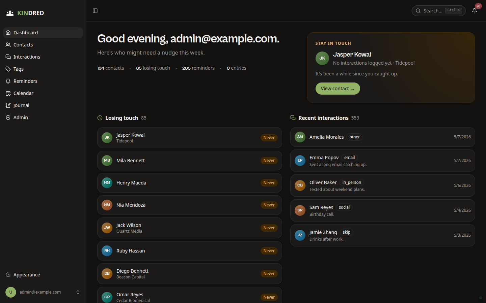
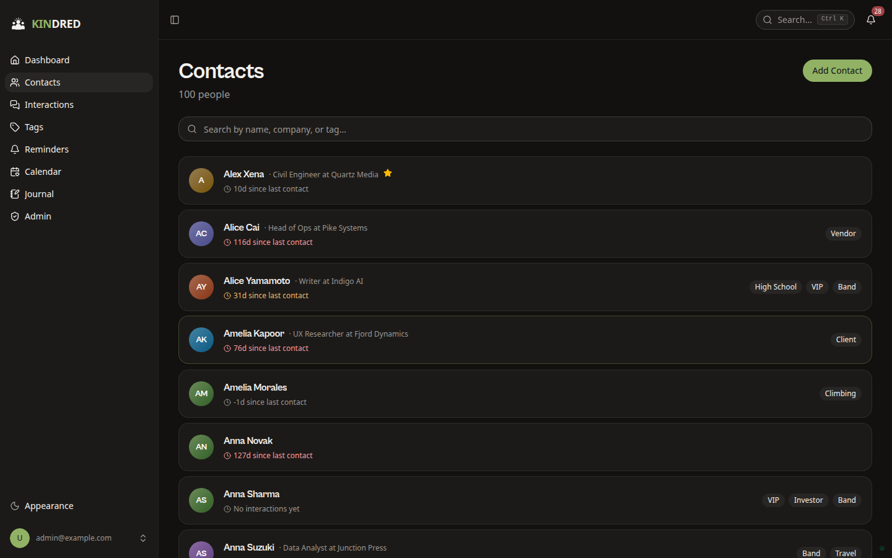
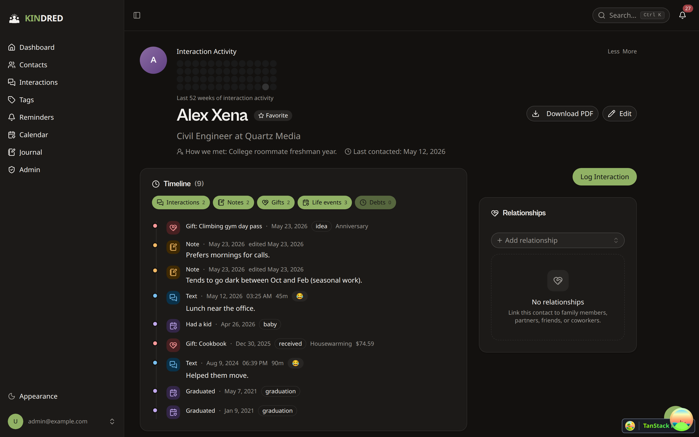
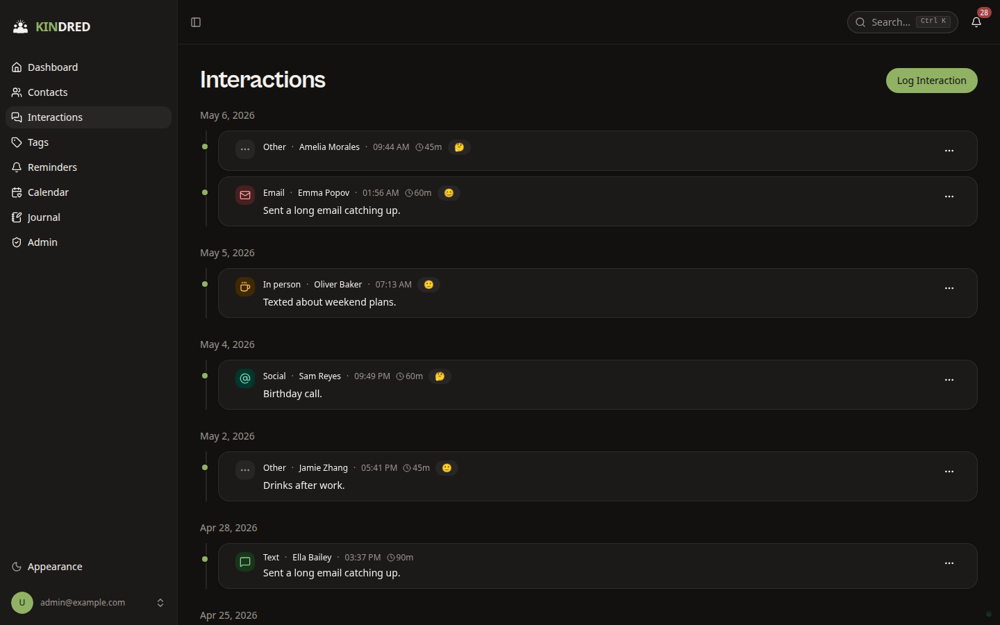
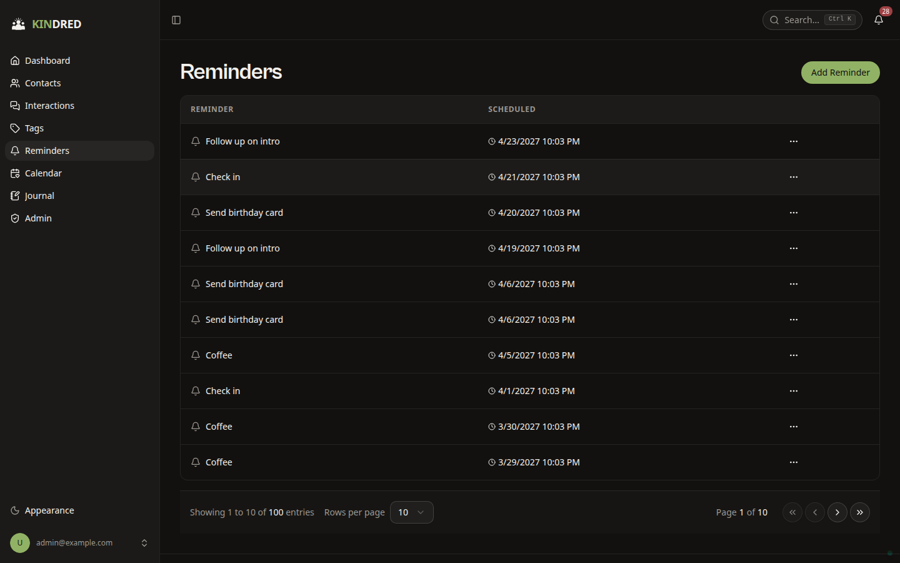
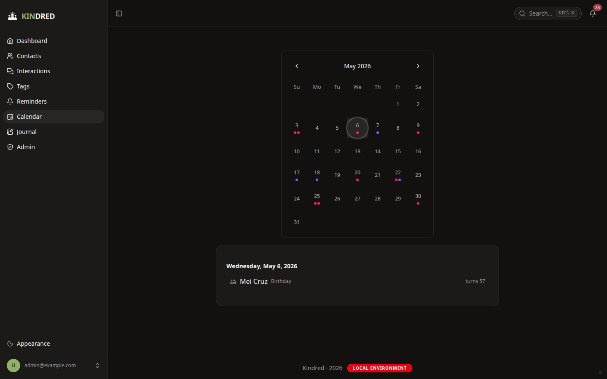
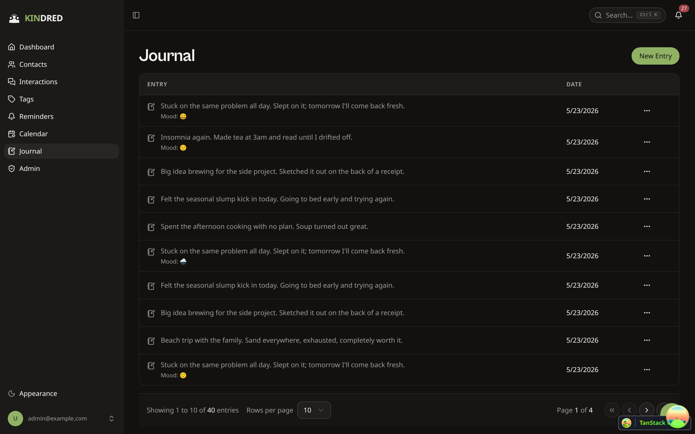
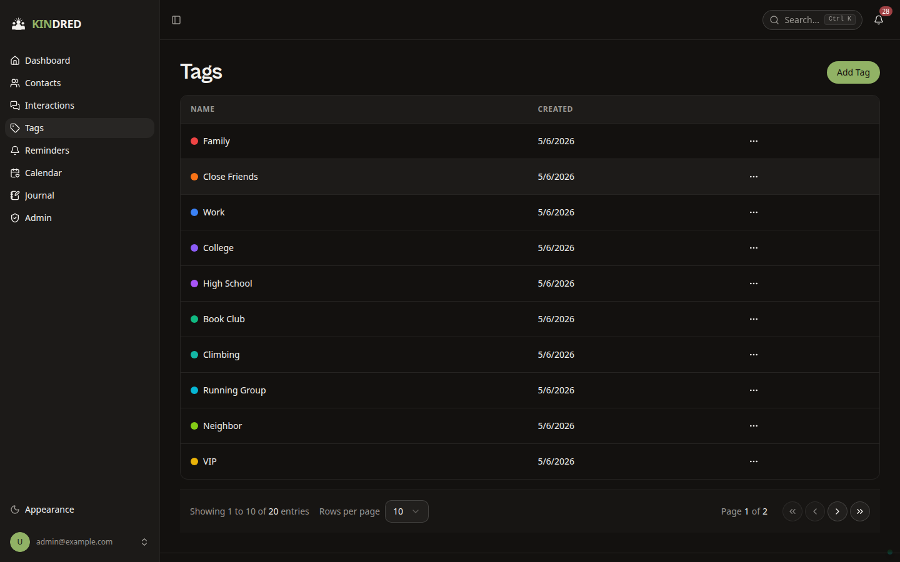

# Kindred

A self-hosted personal CRM for tracking your relationships — contacts, interactions, reminders, gifts, debts, journal entries — with CardDAV sync, full-text search, and a React frontend. Built on the
[FastAPI full-stack template](https://github.com/fastapi/full-stack-fastapi-template) and deployed to a homelab via Docker Compose behind Traefik.

## Stack

| Layer | What |
| --- | --- |
| Backend | FastAPI + SQLModel + Alembic, Python 3.12, `uv` |
| Database | PostgreSQL 18 |
| Search | Meilisearch (indexed via ARQ background tasks) |
| Queue | Redis + [arq](https://arq-docs.helpmanual.io/) worker |
| CardDAV | [Radicale](https://radicale.org/) mounted into the FastAPI app |
| Frontend | React + TanStack Router + TanStack Query + Vite + Bun + Tailwind + shadcn/ui |
| Auth | JWT access tokens, first-superuser bootstrap, password recovery via SMTP |
| E2E | Puppeteer (in `e2e/`) |
| Deploy | Docker Compose + Traefik; secrets via [sops](https://getsops.io/) + age |

## Features

### Shipped (frontend + backend)

- **Contacts** — CRUD, favorites, archive, tagging, groups, list/detail views, inline editing
- **Interactions** — Log calls, texts, emails, in-person meetings, notes per interaction
- **Reminders** — Scheduled reminders with date/time, per-contact linking
- **Tags & Groups** — Organize contacts, many-to-many relationships
- **Journal** — Freeform personal journaling with entries
- **Gifts** — Track gifts given/received per contact
- **Debts** — "I owe them" / "they owe me" tracking per contact
- **Notes** — Freeform notes attached to a contact
- **Users & Admin** — Signup, login, logout, password recovery, superuser-gated user management
- **Dashboard** — Stats, "losing touch" suggestions, recent interactions

### Backend-only (no UI yet)

These routes are registered and tested at the API level, but have no frontend pages. Either build the UI or remove them when you decide the feature is out of scope.

- `addresses`, `pets`, `relationships`, `contact_fields` — read-only rendering on the contact detail page, no add/edit UI
- `custom_fields` — per-contact arbitrary fields
- `life_events` — birthdays, anniversaries, major events
- `import_export` — bulk contact import/export (CSV / vCard)
- `webhooks` — outbound webhook registrations

The Copier template's `items` module has been **removed from the API router** (the model + Alembic table remain for now — drop with a dedicated migration if/when desired).

## Screenshots

> Captured against the seeded fake-data fixture (`just seed-fixed`), 1440×900.

Dashboard — stats, "losing touch" queue, and recent interactions:



Contacts list — last-contact decay indicator, tags, and company/role:



Contact detail — timeline of interactions, notes, gifts, and life events with a relationships sidebar:



Interactions feed grouped by date with channel badges:



Reminders:



Calendar — birthdays and life-event anniversaries surfaced per day:



Journal — freeform daily entries with optional mood:



Tags:



## Layout

```
backend/       FastAPI app, Alembic migrations, pytest suite, Radicale CardDAV bridge
frontend/      React app (Vite), generated OpenAPI client in src/client/
e2e/           Puppeteer end-to-end tests (bun run e2e/*.test.ts)
docs/          architecture.md, DB_SCHEMA.md, HANDOFF.md
compose.yml    Homelab production stack (kindrednet networks, Meilisearch, Redis, ARQ worker)
compose.dev.yml Dev-against-homelab overlay (bind-mounted source, --reload, frontend dev server)
.env           Runtime env vars (gitignored)
.env.sops      Production secrets, encrypted with sops + age
```

## Running the stack

Production (homelab default):

```bash
docker compose up -d --build
```

Dev against the homelab (bind-mounted source, live reload):

```bash
docker compose -f compose.dev.yml up -d --build
```

First boot runs Alembic migrations and creates the admin user from `FIRST_SUPERUSER` / `FIRST_SUPERUSER_PASSWORD` in `.env`.

## Testing

Backend (inside the running stack):

```bash
docker compose exec backend bash scripts/tests-start.sh
```

End-to-end (Puppeteer, requires a running stack):

```bash
bun install
bun run e2e
```

## Secrets

Production secrets live in `.env.sops`, encrypted with age. Rotate with:

```bash
EDITOR=vim sops .env.sops
```

> Note: because `.env.sops` uses the `.sops` extension (not a format sops auto-detects), you may need `--input-type dotenv --output-type dotenv`, or temporarily copy to a `*.env` path for editing.

After rotating `FIRST_SUPERUSER_PASSWORD`, the change only takes effect on fresh deployments. Existing homelab databases retain the old superuser password until you manually update it (or delete and recreate the user via `initial_data.py`).

## Deployment tiers

Three isolated environments. Each has its own credentials, database, and Docker volumes — nothing is shared across tiers.

| Tier | Where | Domain | Stack | Database | Backups |
|---|---|---|---|---|---|
| **Prod** | `~/Documents/Homelab/apps/kindred/` on ares | `kindred.khanpikehome.com` (tailnet-only) | Plain `docker compose`, single combined image `ghcr.io/pike00/kindred:vX.Y.Z` | `kindred-db` Postgres container, volume `kindred_db_data`, database `kindred` | Daily pg-dump at 03:17 + Kopia to S3+B2, 30-day retention |
| **Dev** | `~/projects/personal-crm/` | `kindred.dev.khanpikehome.com` (tailnet-only) | `compose.dev.yml` overlay (bind-mounted source, live reload) | Project-local `dev-db` volume, database `crm` | None (ephemeral) |
| **PR previews** | Deferred indefinitely | — | — | — | — |

### Hard isolation enforced by

- Distinct Postgres credentials per tier — secrets live only in their own `.env.sops`
- Distinct Docker volumes (`kindred_db_data` for prod, project-local `dev-db` for dev) — no `external: true` cross-references between tiers
- Distinct Docker networks — `pikenet-internal-kindred` for prod, default bridge for dev
- Distinct database names — prod is `kindred`, dev is `crm`
- Traefik label pinning — prod compose has the domain hard-coded, dev compose has its own hard-coded dev hostname; neither uses a `${DOMAIN}` variable that could claim the other's hostname

### Releasing to prod

Images are built and pushed to GHCR by the GHA pipeline when a `v*` tag is pushed. Deployment is manual:

```bash
# on ares, from ~/Documents/Homelab/
just bump apps/kindred <tag>   # e.g. v0.2.0
```

The `bump` recipe does a pg-dump before pulling the new image. Never bump without it.

## Origin

This project was scaffolded from the [FastAPI full-stack template](https://github.com/fastapi/full-stack-fastapi-template) via Copier. The `backend/README.md` and `frontend/README.md` files are still mostly upstream template content — treat them as reference, not project-specific docs.
