# crm

## Tables

| Name | Columns | Comment | Type |
| ---- | ------- | ------- | ---- |
| [public.alembic_version](public.alembic_version.md) | 1 |  | BASE TABLE |
| [public.user](public.user.md) | 9 | Authenticated user; tenant-scope owner of every row below. | BASE TABLE |
| [public.tag](public.tag.md) | 5 | User-defined tag for grouping contacts. | BASE TABLE |
| [public.group](public.group.md) | 5 | Named collection of contacts (e.g. 'Family', 'Work Team'). | BASE TABLE |
| [public.contact](public.contact.md) | 28 | Core contact entity — the subject of everything else in the CRM. | BASE TABLE |
| [public.contact_tag](public.contact_tag.md) | 2 | Many-to-many link between contacts and tags. | BASE TABLE |
| [public.contact_group](public.contact_group.md) | 2 | Many-to-many link between contacts and groups. | BASE TABLE |
| [public.contact_field](public.contact_field.md) | 7 | Flexible contact info (emails, phones) attached to a contact. | BASE TABLE |
| [public.address](public.address.md) | 11 | Physical address attached to a contact. | BASE TABLE |
| [public.relationship](public.relationship.md) | 6 | Directional link between two contacts (spouse, child, friend, etc.). | BASE TABLE |
| [public.pet](public.pet.md) | 6 | Pet owned by a contact; useful for memorable conversation hooks. | BASE TABLE |
| [public.custom_field_definition](public.custom_field_definition.md) | 8 | User-defined custom field schema, scoped to one owner. | BASE TABLE |
| [public.custom_field_value](public.custom_field_value.md) | 4 | Value of a custom field for a specific contact (one per contact per definition). | BASE TABLE |
| [public.interaction](public.interaction.md) | 8 | Logged touchpoint with one or more contacts (call, meeting, text, etc.). Attendees are attached via interaction_attendee. | BASE TABLE |
| [public.reminder](public.reminder.md) | 11 | Scheduled reminder; contact-specific or standalone. | BASE TABLE |
| [public.gift](public.gift.md) | 12 | Gift idea or record for a contact. | BASE TABLE |
| [public.debt](public.debt.md) | 10 | Money owed to or from a contact. | BASE TABLE |
| [public.life_event](public.life_event.md) | 9 | Milestone on a contact's timeline (job change, wedding, move, etc.). | BASE TABLE |
| [public.note](public.note.md) | 6 | Timestamped freeform note attached to a specific contact. | BASE TABLE |
| [public.journal_entry](public.journal_entry.md) | 7 | Personal journal entry, not tied to a specific contact. | BASE TABLE |
| [public.webhook_endpoint](public.webhook_endpoint.md) | 10 | Inbound or outbound webhook configuration. | BASE TABLE |
| [public.tag_share](public.tag_share.md) | 3 | Grants another user read access to all rows bearing a given tag. | BASE TABLE |
| [public.media_recommendation](public.media_recommendation.md) | 10 | Media (book, show, podcast, etc.) recommended to or by a contact. | BASE TABLE |
| [public.interaction_attendee](public.interaction_attendee.md) | 2 | Many-to-many link between interactions and contacts (attendees). | BASE TABLE |
| [public.activity_log](public.activity_log.md) | 8 |  | BASE TABLE |
| [public.oauth_credential](public.oauth_credential.md) | 11 |  | BASE TABLE |
| [public.note_mention](public.note_mention.md) | 2 |  | BASE TABLE |
| [public.communication_preference](public.communication_preference.md) | 8 |  | BASE TABLE |

## Stored procedures and functions

| Name | ReturnType | Arguments | Type |
| ---- | ------- | ------- | ---- |
| public.uuid_nil | uuid |  | FUNCTION |
| public.uuid_ns_dns | uuid |  | FUNCTION |
| public.uuid_ns_url | uuid |  | FUNCTION |
| public.uuid_ns_oid | uuid |  | FUNCTION |
| public.uuid_ns_x500 | uuid |  | FUNCTION |
| public.uuid_generate_v1 | uuid |  | FUNCTION |
| public.uuid_generate_v1mc | uuid |  | FUNCTION |
| public.uuid_generate_v3 | uuid | namespace uuid, name text | FUNCTION |
| public.uuid_generate_v4 | uuid |  | FUNCTION |
| public.uuid_generate_v5 | uuid | namespace uuid, name text | FUNCTION |

## Enums

| Name | Values |
| ---- | ------- |
| public.contactfieldtype | EMAIL, PHONE |
| public.contactsource | CARDDAV, GOOGLE, MANUAL, VCARD_IMPORT, WEBHOOK |
| public.debtdirection | I_OWE, THEY_OWE |
| public.giftstatus | GIVEN, IDEA, RECEIVED |
| public.interactionchannel | CALL, EMAIL, IN_PERSON, OTHER, SOCIAL, TEXT, VIDEO |
| public.mediacategory | BOOK, MOVIE, MUSICIAN, OTHER, PODCAST, TV_SHOW |
| public.oauthprovider | GOOGLE |
| public.reminderfrequency | DAILY, MONTHLY, ONCE, WEEKLY, YEARLY |

## Relations

```mermaid
erDiagram

"public.tag" }o--|| "public.user" : "FOREIGN KEY (owner_id) REFERENCES #quot;user#quot;(id) ON DELETE CASCADE"
"public.group" }o--|| "public.user" : "FOREIGN KEY (owner_id) REFERENCES #quot;user#quot;(id) ON DELETE CASCADE"
"public.contact" }o--|| "public.user" : "FOREIGN KEY (owner_id) REFERENCES #quot;user#quot;(id) ON DELETE CASCADE"
"public.contact_tag" }o--|| "public.tag" : "FOREIGN KEY (tag_id) REFERENCES tag(id) ON DELETE CASCADE"
"public.contact_tag" }o--|| "public.contact" : "FOREIGN KEY (contact_id) REFERENCES contact(id) ON DELETE CASCADE"
"public.contact_group" }o--|| "public.group" : "FOREIGN KEY (group_id) REFERENCES #quot;group#quot;(id) ON DELETE CASCADE"
"public.contact_group" }o--|| "public.contact" : "FOREIGN KEY (contact_id) REFERENCES contact(id) ON DELETE CASCADE"
"public.contact_field" }o--|| "public.contact" : "FOREIGN KEY (contact_id) REFERENCES contact(id) ON DELETE CASCADE"
"public.address" }o--|| "public.contact" : "FOREIGN KEY (contact_id) REFERENCES contact(id) ON DELETE CASCADE"
"public.relationship" }o--|| "public.contact" : "FOREIGN KEY (contact_id) REFERENCES contact(id) ON DELETE CASCADE"
"public.relationship" }o--|| "public.contact" : "FOREIGN KEY (related_contact_id) REFERENCES contact(id) ON DELETE CASCADE"
"public.relationship" }o--o| "public.relationship" : "FOREIGN KEY (inverse_id) REFERENCES relationship(id) ON DELETE SET NULL"
"public.pet" }o--|| "public.contact" : "FOREIGN KEY (contact_id) REFERENCES contact(id) ON DELETE CASCADE"
"public.custom_field_definition" }o--|| "public.user" : "FOREIGN KEY (owner_id) REFERENCES #quot;user#quot;(id) ON DELETE CASCADE"
"public.custom_field_value" }o--|| "public.contact" : "FOREIGN KEY (contact_id) REFERENCES contact(id) ON DELETE CASCADE"
"public.custom_field_value" }o--|| "public.custom_field_definition" : "FOREIGN KEY (field_definition_id) REFERENCES custom_field_definition(id) ON DELETE CASCADE"
"public.interaction" }o--|| "public.user" : "FOREIGN KEY (owner_id) REFERENCES #quot;user#quot;(id) ON DELETE CASCADE"
"public.reminder" }o--|| "public.user" : "FOREIGN KEY (owner_id) REFERENCES #quot;user#quot;(id) ON DELETE CASCADE"
"public.reminder" }o--o| "public.contact" : "FOREIGN KEY (contact_id) REFERENCES contact(id) ON DELETE CASCADE"
"public.gift" }o--|| "public.user" : "FOREIGN KEY (owner_id) REFERENCES #quot;user#quot;(id) ON DELETE CASCADE"
"public.gift" }o--|| "public.contact" : "FOREIGN KEY (contact_id) REFERENCES contact(id) ON DELETE CASCADE"
"public.debt" }o--|| "public.user" : "FOREIGN KEY (owner_id) REFERENCES #quot;user#quot;(id) ON DELETE CASCADE"
"public.debt" }o--|| "public.contact" : "FOREIGN KEY (contact_id) REFERENCES contact(id) ON DELETE CASCADE"
"public.life_event" }o--|| "public.user" : "FOREIGN KEY (owner_id) REFERENCES #quot;user#quot;(id) ON DELETE CASCADE"
"public.life_event" }o--|| "public.contact" : "FOREIGN KEY (contact_id) REFERENCES contact(id) ON DELETE CASCADE"
"public.note" }o--|| "public.user" : "FOREIGN KEY (owner_id) REFERENCES #quot;user#quot;(id) ON DELETE CASCADE"
"public.note" }o--|| "public.contact" : "FOREIGN KEY (contact_id) REFERENCES contact(id) ON DELETE CASCADE"
"public.journal_entry" }o--|| "public.user" : "FOREIGN KEY (owner_id) REFERENCES #quot;user#quot;(id) ON DELETE CASCADE"
"public.webhook_endpoint" }o--|| "public.user" : "FOREIGN KEY (owner_id) REFERENCES #quot;user#quot;(id) ON DELETE CASCADE"
"public.tag_share" }o--|| "public.user" : "FOREIGN KEY (grantee_id) REFERENCES #quot;user#quot;(id) ON DELETE CASCADE"
"public.tag_share" }o--|| "public.tag" : "FOREIGN KEY (tag_id) REFERENCES tag(id) ON DELETE CASCADE"
"public.media_recommendation" }o--|| "public.user" : "FOREIGN KEY (owner_id) REFERENCES #quot;user#quot;(id) ON DELETE CASCADE"
"public.media_recommendation" }o--|| "public.contact" : "FOREIGN KEY (contact_id) REFERENCES contact(id) ON DELETE CASCADE"
"public.interaction_attendee" }o--|| "public.contact" : "FOREIGN KEY (contact_id) REFERENCES contact(id) ON DELETE CASCADE"
"public.interaction_attendee" }o--|| "public.interaction" : "FOREIGN KEY (interaction_id) REFERENCES interaction(id) ON DELETE CASCADE"
"public.activity_log" }o--o| "public.user" : "FOREIGN KEY (actor_id) REFERENCES #quot;user#quot;(id) ON DELETE SET NULL"
"public.activity_log" }o--|| "public.user" : "FOREIGN KEY (owner_id) REFERENCES #quot;user#quot;(id) ON DELETE CASCADE"
"public.oauth_credential" }o--|| "public.user" : "FOREIGN KEY (user_id) REFERENCES #quot;user#quot;(id) ON DELETE CASCADE"
"public.note_mention" }o--|| "public.contact" : "FOREIGN KEY (contact_id) REFERENCES contact(id) ON DELETE CASCADE"
"public.note_mention" }o--|| "public.note" : "FOREIGN KEY (note_id) REFERENCES note(id) ON DELETE CASCADE"
"public.communication_preference" |o--|| "public.contact" : "FOREIGN KEY (contact_id) REFERENCES contact(id) ON DELETE CASCADE"

"public.alembic_version" {
  varchar_32_ version_num
}
"public.user" {
  varchar_255_ email
  boolean is_active
  boolean is_superuser
  varchar_255_ full_name
  varchar hashed_password
  uuid id
  timestamp_with_time_zone created_at
  varchar_512_ oidc_iss
  varchar_255_ oidc_sub
}
"public.tag" {
  uuid id
  uuid owner_id FK
  varchar_100_ name
  varchar_7_ color
  timestamp_with_time_zone created_at
}
"public.group" {
  uuid id
  uuid owner_id FK
  varchar_255_ name
  varchar_1000_ description
  timestamp_with_time_zone created_at
}
"public.contact" {
  uuid id
  uuid owner_id FK
  varchar_255_ first_name
  varchar_255_ last_name
  varchar_255_ middle_name
  varchar_50_ prefix
  varchar_50_ suffix
  varchar_255_ nickname
  varchar_255_ company
  varchar_255_ department
  varchar_255_ title
  date birthday
  varchar_2000_ how_we_met
  boolean is_favorite
  boolean is_archived
  boolean is_deceased
  date deceased_at
  integer contact_frequency_days
  varchar_100_ stage
  varchar vcard_raw
  varchar_255_ vcard_etag
  varchar_2048_ avatar_url
  timestamp_with_time_zone last_contacted_at
  timestamp_with_time_zone created_at
  timestamp_with_time_zone updated_at
  timestamp_with_time_zone deleted_at
  contactsource source
  varchar_500_ source_external_id
}
"public.contact_tag" {
  uuid contact_id FK
  uuid tag_id FK
}
"public.contact_group" {
  uuid contact_id FK
  uuid group_id FK
}
"public.contact_field" {
  uuid id
  uuid contact_id FK
  contactfieldtype field_type
  varchar_100_ label
  varchar_2048_ value
  boolean is_primary
  integer sort_order
}
"public.address" {
  uuid id
  uuid contact_id FK
  varchar_100_ label
  varchar_500_ street
  varchar_500_ extended
  varchar_255_ city
  varchar_255_ region
  varchar_50_ postal_code
  varchar_255_ country
  double_precision latitude
  double_precision longitude
}
"public.relationship" {
  uuid id
  uuid contact_id FK
  uuid related_contact_id FK
  varchar_100_ relationship_type
  varchar_1000_ notes
  uuid inverse_id FK
}
"public.pet" {
  uuid id
  uuid contact_id FK
  varchar_255_ name
  varchar_100_ species
  varchar_100_ breed
  varchar_1000_ notes
}
"public.custom_field_definition" {
  uuid id
  uuid owner_id FK
  varchar_255_ name
  varchar_50_ field_type
  varchar_500_ description
  varchar_2000_ options
  varchar_50_ icon
  timestamp_with_time_zone created_at
}
"public.custom_field_value" {
  uuid id
  uuid contact_id FK
  uuid field_definition_id FK
  varchar_5000_ value
}
"public.interaction" {
  uuid id
  uuid owner_id FK
  interactionchannel channel
  timestamp_with_time_zone occurred_at
  varchar_10000_ notes
  varchar_50_ mood
  integer duration_minutes
  timestamp_with_time_zone created_at
}
"public.reminder" {
  uuid id
  uuid owner_id FK
  uuid contact_id FK
  varchar_500_ title
  varchar_2000_ description
  timestamp_with_time_zone remind_at
  reminderfrequency frequency
  boolean is_active
  timestamp_with_time_zone last_sent_at
  timestamp_with_time_zone snoozed_until
  timestamp_with_time_zone created_at
}
"public.gift" {
  uuid id
  uuid owner_id FK
  uuid contact_id FK
  varchar_500_ name
  varchar_2000_ description
  giftstatus status
  varchar_255_ occasion
  date date
  double_precision value_amount
  varchar_3_ value_currency
  varchar_2048_ url
  timestamp_with_time_zone created_at
}
"public.debt" {
  uuid id
  uuid owner_id FK
  uuid contact_id FK
  debtdirection direction
  double_precision amount
  varchar_3_ currency
  varchar_1000_ reason
  boolean is_settled
  date settled_at
  timestamp_with_time_zone created_at
}
"public.life_event" {
  uuid id
  uuid owner_id FK
  uuid contact_id FK
  varchar_100_ event_type
  varchar_500_ title
  varchar_2000_ description
  date occurred_at
  boolean create_annual_reminder
  timestamp_with_time_zone created_at
}
"public.note" {
  uuid id
  uuid owner_id FK
  uuid contact_id FK
  varchar_50000_ body
  timestamp_with_time_zone created_at
  timestamp_with_time_zone updated_at
}
"public.journal_entry" {
  uuid id
  uuid owner_id FK
  varchar_50000_ body
  varchar_50_ mood
  date entry_date
  timestamp_with_time_zone created_at
  timestamp_with_time_zone updated_at
}
"public.webhook_endpoint" {
  uuid id
  uuid owner_id FK
  varchar_255_ name
  varchar_2048_ url
  varchar_10_ direction
  varchar_1000_ event_types
  boolean is_active
  varchar_255_ secret
  varchar_255_ api_key
  timestamp_with_time_zone created_at
}
"public.tag_share" {
  uuid tag_id FK
  uuid grantee_id FK
  timestamp_with_time_zone created_at
}
"public.media_recommendation" {
  uuid id
  uuid owner_id FK
  uuid contact_id FK
  mediacategory category
  varchar_500_ title
  varchar_500_ creator
  varchar_5000_ note
  date recommended_at
  timestamp_with_time_zone created_at
  timestamp_with_time_zone updated_at
}
"public.interaction_attendee" {
  uuid interaction_id FK
  uuid contact_id FK
}
"public.activity_log" {
  uuid id
  uuid owner_id FK
  uuid actor_id FK
  varchar_64_ entity_type
  uuid entity_id
  varchar_32_ action
  json changes_json
  timestamp_with_time_zone occurred_at
}
"public.oauth_credential" {
  uuid id
  uuid user_id FK
  oauthprovider provider
  varchar encrypted_refresh_token
  varchar encrypted_access_token
  timestamp_with_time_zone access_token_expires_at
  varchar_2000_ scopes
  varchar_4000_ sync_token
  timestamp_with_time_zone last_synced_at
  timestamp_with_time_zone created_at
  timestamp_with_time_zone updated_at
}
"public.note_mention" {
  uuid note_id FK
  uuid contact_id FK
}
"public.communication_preference" {
  uuid id
  uuid contact_id FK
  varchar_20_ preferred_channel
  varchar_11_ best_time_local
  boolean do_not_contact
  varchar_500_ do_not_contact_reason
  timestamp_with_time_zone created_at
  timestamp_with_time_zone updated_at
}
```

---

> Generated by [tbls](https://github.com/k1LoW/tbls)
