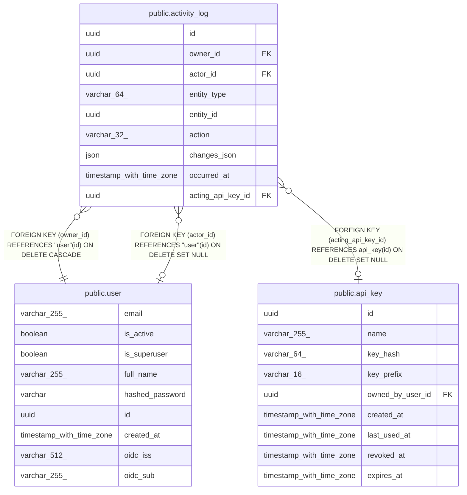

# public.activity_log

## Columns

| Name | Type | Default | Nullable | Children | Parents | Comment |
| ---- | ---- | ------- | -------- | -------- | ------- | ------- |
| id | uuid |  | false |  |  |  |
| owner_id | uuid |  | false |  | [public.user](public.user.md) |  |
| actor_id | uuid |  | true |  | [public.user](public.user.md) |  |
| entity_type | varchar(64) |  | false |  |  |  |
| entity_id | uuid |  | false |  |  |  |
| action | varchar(32) |  | false |  |  |  |
| changes_json | json |  | true |  |  |  |
| occurred_at | timestamp with time zone |  | false |  |  |  |
| acting_api_key_id | uuid |  | true |  | [public.api_key](public.api_key.md) |  |

## Constraints

| Name | Type | Definition |
| ---- | ---- | ---------- |
| activity_log_action_not_null | n | NOT NULL action |
| activity_log_entity_id_not_null | n | NOT NULL entity_id |
| activity_log_entity_type_not_null | n | NOT NULL entity_type |
| activity_log_id_not_null | n | NOT NULL id |
| activity_log_occurred_at_not_null | n | NOT NULL occurred_at |
| activity_log_owner_id_not_null | n | NOT NULL owner_id |
| activity_log_actor_id_fkey | FOREIGN KEY | FOREIGN KEY (actor_id) REFERENCES "user"(id) ON DELETE SET NULL |
| activity_log_owner_id_fkey | FOREIGN KEY | FOREIGN KEY (owner_id) REFERENCES "user"(id) ON DELETE CASCADE |
| activity_log_pkey | PRIMARY KEY | PRIMARY KEY (id) |
| fk_activity_log_acting_api_key_id | FOREIGN KEY | FOREIGN KEY (acting_api_key_id) REFERENCES api_key(id) ON DELETE SET NULL |

## Indexes

| Name | Definition |
| ---- | ---------- |
| activity_log_pkey | CREATE UNIQUE INDEX activity_log_pkey ON public.activity_log USING btree (id) |
| ix_activity_log_owner_id | CREATE INDEX ix_activity_log_owner_id ON public.activity_log USING btree (owner_id) |
| ix_activity_log_actor_id | CREATE INDEX ix_activity_log_actor_id ON public.activity_log USING btree (actor_id) |
| ix_activity_log_entity_id | CREATE INDEX ix_activity_log_entity_id ON public.activity_log USING btree (entity_id) |
| ix_activity_log_acting_api_key_id | CREATE INDEX ix_activity_log_acting_api_key_id ON public.activity_log USING btree (acting_api_key_id) |

## Relations

---

> Generated by [tbls](https://github.com/k1LoW/tbls)
