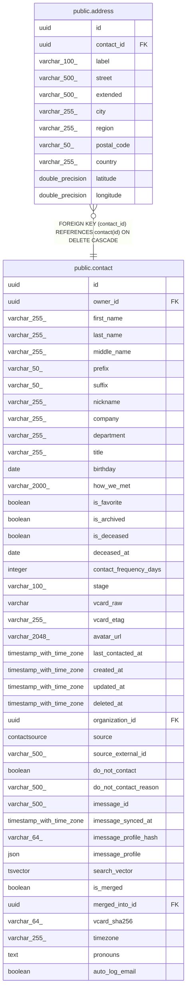

# public.address

## Description

Physical address attached to a contact.

## Columns

| Name | Type | Default | Nullable | Children | Parents | Comment |
| ---- | ---- | ------- | -------- | -------- | ------- | ------- |
| id | uuid |  | false |  |  | Primary key. |
| contact_id | uuid |  | false |  | [public.contact](public.contact.md) | Parent contact; cascades on delete. |
| label | varchar(100) |  | false |  |  | Label like "home", "work", "other". |
| street | varchar(500) |  | true |  |  | Street line 1. |
| extended | varchar(500) |  | true |  |  | Apartment, suite, floor, etc. |
| city | varchar(255) |  | true |  |  | City. |
| region | varchar(255) |  | true |  |  | State, province, or region. |
| postal_code | varchar(50) |  | true |  |  | ZIP or postal code. |
| country | varchar(255) |  | true |  |  | Country. |
| latitude | double precision |  | true |  |  | Geocoded latitude; used for map visualization. |
| longitude | double precision |  | true |  |  | Geocoded longitude; used for map visualization. |

## Constraints

| Name | Type | Definition |
| ---- | ---- | ---------- |
| address_contact_id_not_null | n | NOT NULL contact_id |
| address_id_not_null | n | NOT NULL id |
| address_label_not_null | n | NOT NULL label |
| address_contact_id_fkey | FOREIGN KEY | FOREIGN KEY (contact_id) REFERENCES contact(id) ON DELETE CASCADE |
| address_pkey | PRIMARY KEY | PRIMARY KEY (id) |

## Indexes

| Name | Definition |
| ---- | ---------- |
| address_pkey | CREATE UNIQUE INDEX address_pkey ON public.address USING btree (id) |
| ix_address_contact_id | CREATE INDEX ix_address_contact_id ON public.address USING btree (contact_id) |

## Relations

---

> Generated by [tbls](https://github.com/k1LoW/tbls)
