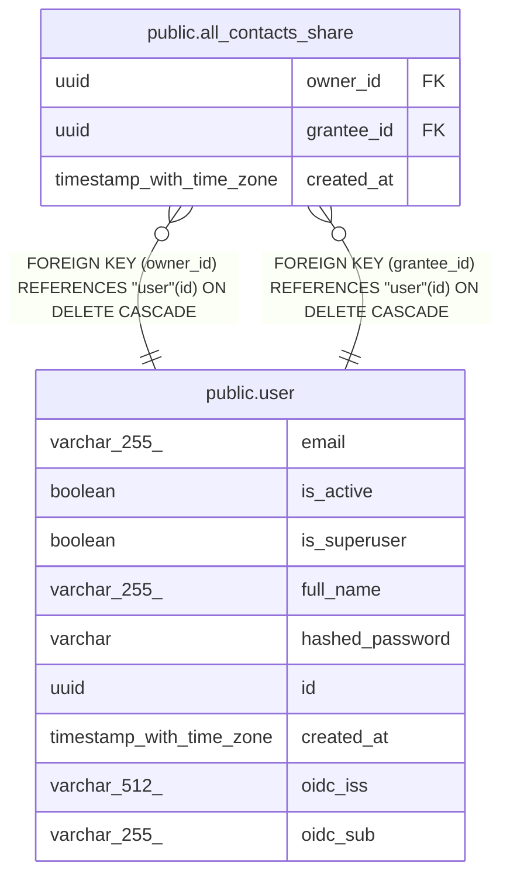

# public.all_contacts_share

## Description

Grants another user access to all current and future contacts by owner.

## Columns

| Name | Type | Default | Nullable | Children | Parents | Comment |
| ---- | ---- | ------- | -------- | -------- | ------- | ------- |
| owner_id | uuid |  | false |  | [public.user](public.user.md) | Grantor whose contacts are being shared; cascades on delete. |
| grantee_id | uuid |  | false |  | [public.user](public.user.md) | User granted access; cascades on delete. |
| created_at | timestamp with time zone | now() | false |  |  | When the all-contacts share was granted (UTC). |

## Constraints

| Name | Type | Definition |
| ---- | ---- | ---------- |
| all_contacts_share_created_at_not_null | n | NOT NULL created_at |
| all_contacts_share_grantee_id_not_null | n | NOT NULL grantee_id |
| all_contacts_share_owner_id_not_null | n | NOT NULL owner_id |
| all_contacts_share_grantee_id_fkey | FOREIGN KEY | FOREIGN KEY (grantee_id) REFERENCES "user"(id) ON DELETE CASCADE |
| all_contacts_share_owner_id_fkey | FOREIGN KEY | FOREIGN KEY (owner_id) REFERENCES "user"(id) ON DELETE CASCADE |
| all_contacts_share_pkey | PRIMARY KEY | PRIMARY KEY (owner_id, grantee_id) |

## Indexes

| Name | Definition |
| ---- | ---------- |
| all_contacts_share_pkey | CREATE UNIQUE INDEX all_contacts_share_pkey ON public.all_contacts_share USING btree (owner_id, grantee_id) |

## Relations

---

> Generated by [tbls](https://github.com/k1LoW/tbls)
