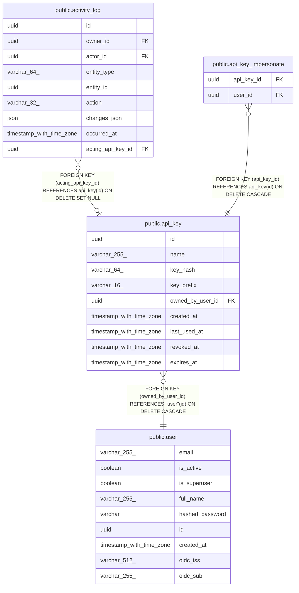

# public.api_key

## Columns

| Name | Type | Default | Nullable | Children | Parents | Comment |
| ---- | ---- | ------- | -------- | -------- | ------- | ------- |
| id | uuid |  | false | [public.activity_log](public.activity_log.md) [public.api_key_impersonate](public.api_key_impersonate.md) |  |  |
| name | varchar(255) |  | false |  |  |  |
| key_hash | varchar(64) |  | false |  |  |  |
| key_prefix | varchar(16) |  | false |  |  |  |
| owned_by_user_id | uuid |  | false |  | [public.user](public.user.md) |  |
| created_at | timestamp with time zone | now() | false |  |  |  |
| last_used_at | timestamp with time zone |  | true |  |  |  |
| revoked_at | timestamp with time zone |  | true |  |  |  |
| expires_at | timestamp with time zone |  | true |  |  |  |

## Constraints

| Name | Type | Definition |
| ---- | ---- | ---------- |
| api_key_created_at_not_null | n | NOT NULL created_at |
| api_key_id_not_null | n | NOT NULL id |
| api_key_key_hash_not_null | n | NOT NULL key_hash |
| api_key_key_prefix_not_null | n | NOT NULL key_prefix |
| api_key_name_not_null | n | NOT NULL name |
| api_key_owned_by_user_id_not_null | n | NOT NULL owned_by_user_id |
| api_key_owned_by_user_id_fkey | FOREIGN KEY | FOREIGN KEY (owned_by_user_id) REFERENCES "user"(id) ON DELETE CASCADE |
| api_key_pkey | PRIMARY KEY | PRIMARY KEY (id) |
| uq_api_key_key_hash | UNIQUE | UNIQUE (key_hash) |

## Indexes

| Name | Definition |
| ---- | ---------- |
| api_key_pkey | CREATE UNIQUE INDEX api_key_pkey ON public.api_key USING btree (id) |
| uq_api_key_key_hash | CREATE UNIQUE INDEX uq_api_key_key_hash ON public.api_key USING btree (key_hash) |
| ix_api_key_key_hash | CREATE INDEX ix_api_key_key_hash ON public.api_key USING btree (key_hash) |
| ix_api_key_owned_by_user_id | CREATE INDEX ix_api_key_owned_by_user_id ON public.api_key USING btree (owned_by_user_id) |

## Relations

---

> Generated by [tbls](https://github.com/k1LoW/tbls)
