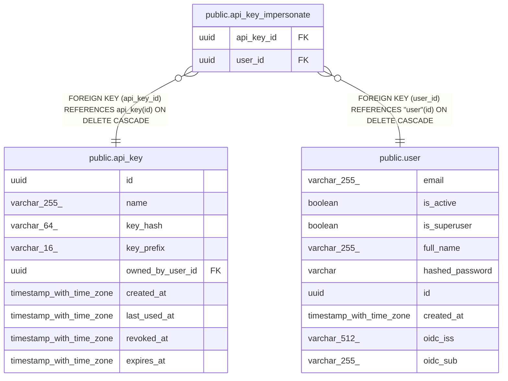

# public.api_key_impersonate

## Columns

| Name | Type | Default | Nullable | Children | Parents | Comment |
| ---- | ---- | ------- | -------- | -------- | ------- | ------- |
| api_key_id | uuid |  | false |  | [public.api_key](public.api_key.md) |  |
| user_id | uuid |  | false |  | [public.user](public.user.md) |  |

## Constraints

| Name | Type | Definition |
| ---- | ---- | ---------- |
| api_key_impersonate_api_key_id_not_null | n | NOT NULL api_key_id |
| api_key_impersonate_user_id_not_null | n | NOT NULL user_id |
| api_key_impersonate_user_id_fkey | FOREIGN KEY | FOREIGN KEY (user_id) REFERENCES "user"(id) ON DELETE CASCADE |
| api_key_impersonate_api_key_id_fkey | FOREIGN KEY | FOREIGN KEY (api_key_id) REFERENCES api_key(id) ON DELETE CASCADE |
| api_key_impersonate_pkey | PRIMARY KEY | PRIMARY KEY (api_key_id, user_id) |

## Indexes

| Name | Definition |
| ---- | ---------- |
| api_key_impersonate_pkey | CREATE UNIQUE INDEX api_key_impersonate_pkey ON public.api_key_impersonate USING btree (api_key_id, user_id) |

## Relations

---

> Generated by [tbls](https://github.com/k1LoW/tbls)
