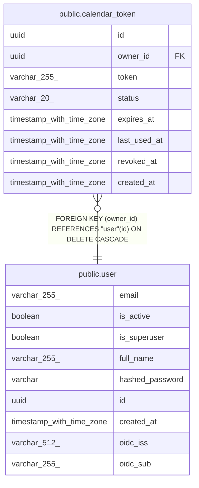

# public.calendar_token

## Columns

| Name | Type | Default | Nullable | Children | Parents | Comment |
| ---- | ---- | ------- | -------- | -------- | ------- | ------- |
| id | uuid |  | false |  |  |  |
| owner_id | uuid |  | false |  | [public.user](public.user.md) |  |
| token | varchar(255) |  | false |  |  |  |
| status | varchar(20) | 'active'::character varying | false |  |  |  |
| expires_at | timestamp with time zone |  | true |  |  |  |
| last_used_at | timestamp with time zone |  | true |  |  |  |
| revoked_at | timestamp with time zone |  | true |  |  |  |
| created_at | timestamp with time zone |  | false |  |  |  |

## Constraints

| Name | Type | Definition |
| ---- | ---- | ---------- |
| calendar_token_created_at_not_null | n | NOT NULL created_at |
| calendar_token_id_not_null | n | NOT NULL id |
| calendar_token_owner_id_not_null | n | NOT NULL owner_id |
| calendar_token_status_not_null | n | NOT NULL status |
| calendar_token_token_not_null | n | NOT NULL token |
| calendar_token_owner_id_fkey | FOREIGN KEY | FOREIGN KEY (owner_id) REFERENCES "user"(id) ON DELETE CASCADE |
| calendar_token_pkey | PRIMARY KEY | PRIMARY KEY (id) |
| calendar_token_token_key | UNIQUE | UNIQUE (token) |

## Indexes

| Name | Definition |
| ---- | ---------- |
| calendar_token_pkey | CREATE UNIQUE INDEX calendar_token_pkey ON public.calendar_token USING btree (id) |
| calendar_token_token_key | CREATE UNIQUE INDEX calendar_token_token_key ON public.calendar_token USING btree (token) |
| ix_calendar_token_token | CREATE UNIQUE INDEX ix_calendar_token_token ON public.calendar_token USING btree (token) |

## Relations

---

> Generated by [tbls](https://github.com/k1LoW/tbls)
