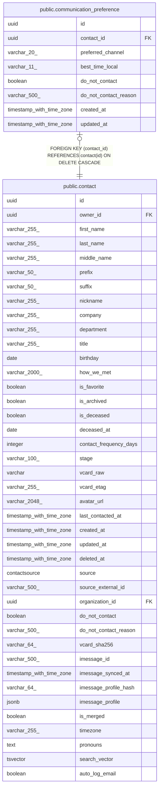

# public.communication_preference

## Columns

| Name | Type | Default | Nullable | Children | Parents | Comment |
| ---- | ---- | ------- | -------- | -------- | ------- | ------- |
| id | uuid |  | false |  |  |  |
| contact_id | uuid |  | false |  | [public.contact](public.contact.md) |  |
| preferred_channel | varchar(20) |  | true |  |  |  |
| best_time_local | varchar(11) |  | true |  |  |  |
| do_not_contact | boolean | false | false |  |  |  |
| do_not_contact_reason | varchar(500) |  | true |  |  |  |
| created_at | timestamp with time zone |  | false |  |  |  |
| updated_at | timestamp with time zone |  | false |  |  |  |

## Constraints

| Name | Type | Definition |
| ---- | ---- | ---------- |
| communication_preference_contact_id_not_null | n | NOT NULL contact_id |
| communication_preference_created_at_not_null | n | NOT NULL created_at |
| communication_preference_do_not_contact_not_null | n | NOT NULL do_not_contact |
| communication_preference_id_not_null | n | NOT NULL id |
| communication_preference_updated_at_not_null | n | NOT NULL updated_at |
| communication_preference_contact_id_fkey | FOREIGN KEY | FOREIGN KEY (contact_id) REFERENCES contact(id) ON DELETE CASCADE |
| communication_preference_pkey | PRIMARY KEY | PRIMARY KEY (id) |
| uq_communication_preference_contact_id | UNIQUE | UNIQUE (contact_id) |

## Indexes

| Name | Definition |
| ---- | ---------- |
| communication_preference_pkey | CREATE UNIQUE INDEX communication_preference_pkey ON public.communication_preference USING btree (id) |
| uq_communication_preference_contact_id | CREATE UNIQUE INDEX uq_communication_preference_contact_id ON public.communication_preference USING btree (contact_id) |
| ix_communication_preference_contact_id | CREATE INDEX ix_communication_preference_contact_id ON public.communication_preference USING btree (contact_id) |
| ix_communication_preference_preferred_channel | CREATE INDEX ix_communication_preference_preferred_channel ON public.communication_preference USING btree (preferred_channel) |

## Relations

---

> Generated by [tbls](https://github.com/k1LoW/tbls)
