# public.contact

## Description

Core contact entity — the subject of everything else in the CRM.

## Columns

| Name | Type | Default | Nullable | Children | Parents | Comment |
| ---- | ---- | ------- | -------- | -------- | ------- | ------- |
| id | uuid |  | false | [public.contact_tag](public.contact_tag.md) [public.contact_group](public.contact_group.md) [public.contact_field](public.contact_field.md) [public.address](public.address.md) [public.relationship](public.relationship.md) [public.pet](public.pet.md) [public.custom_field_value](public.custom_field_value.md) [public.reminder](public.reminder.md) [public.gift](public.gift.md) [public.debt](public.debt.md) [public.life_event](public.life_event.md) [public.note](public.note.md) [public.media_recommendation](public.media_recommendation.md) [public.interaction_attendee](public.interaction_attendee.md) [public.note_mention](public.note_mention.md) |  | Primary key. |
| owner_id | uuid |  | false |  | [public.user](public.user.md) | Owner user; cascades on delete. |
| first_name | varchar(255) |  | false |  |  | Given name; required. |
| last_name | varchar(255) |  | true |  |  | Family name. |
| middle_name | varchar(255) |  | true |  |  | Middle name or initial. |
| prefix | varchar(50) |  | true |  |  | Honorific like Dr., Mr., Ms. |
| suffix | varchar(50) |  | true |  |  | Suffix like Jr., PhD. |
| nickname | varchar(255) |  | true |  |  | Preferred or informal name. |
| company | varchar(255) |  | true |  |  | Organization name. |
| department | varchar(255) |  | true |  |  | Department within the company. |
| title | varchar(255) |  | true |  |  | Job title. |
| birthday | date |  | true |  |  | Date of birth; used for milestone and birthday reminders. |
| how_we_met | varchar(2000) |  | true |  |  | Short story of how the introduction happened. |
| is_favorite | boolean |  | false |  |  | Pinned to the top of contact lists. |
| is_archived | boolean |  | false |  |  | Soft-deleted; excluded from default lists. |
| is_deceased | boolean |  | false |  |  | Marks the contact as deceased. |
| deceased_at | date |  | true |  |  | Date the contact passed away. |
| contact_frequency_days | integer |  | true |  |  | Target days between interactions; drives losing-touch cadence. |
| stage | varchar(100) |  | true |  |  | Kanban stage like Active, Dormant, Lost. |
| vcard_raw | varchar |  | true |  |  | Raw vCard 3.0 text; preserves Apple extensions for CardDAV round-trip. |
| vcard_etag | varchar(255) |  | true |  |  | ETag from the CardDAV server for incremental sync. |
| avatar_url | varchar(2048) |  | true |  |  | URL or on-disk path to the contact's avatar image. |
| last_contacted_at | timestamp with time zone |  | true |  |  | Auto-updated by create_interaction(); powers cadence queries. |
| created_at | timestamp with time zone |  | false |  |  | When the contact was created (UTC). |
| updated_at | timestamp with time zone |  | false |  |  | Auto-bumped on any column change (UTC). |
| deleted_at | timestamp with time zone |  | true |  |  |  |
| source_provider | contactsource | 'MANUAL'::contactsource | false |  |  |  |
| source_external_id | varchar(255) |  | true |  |  |  |

## Constraints

| Name | Type | Definition |
| ---- | ---- | ---------- |
| contact_created_at_not_null | n | NOT NULL created_at |
| contact_first_name_not_null | n | NOT NULL first_name |
| contact_id_not_null | n | NOT NULL id |
| contact_is_archived_not_null | n | NOT NULL is_archived |
| contact_is_deceased_not_null | n | NOT NULL is_deceased |
| contact_is_favorite_not_null | n | NOT NULL is_favorite |
| contact_owner_id_not_null | n | NOT NULL owner_id |
| contact_source_provider_not_null | n | NOT NULL source_provider |
| contact_updated_at_not_null | n | NOT NULL updated_at |
| contact_owner_id_fkey | FOREIGN KEY | FOREIGN KEY (owner_id) REFERENCES "user"(id) ON DELETE CASCADE |
| contact_pkey | PRIMARY KEY | PRIMARY KEY (id) |

## Indexes

| Name | Definition |
| ---- | ---------- |
| contact_pkey | CREATE UNIQUE INDEX contact_pkey ON public.contact USING btree (id) |
| ix_contact_is_archived | CREATE INDEX ix_contact_is_archived ON public.contact USING btree (is_archived) |
| ix_contact_is_favorite | CREATE INDEX ix_contact_is_favorite ON public.contact USING btree (is_favorite) |
| ix_contact_owner_id | CREATE INDEX ix_contact_owner_id ON public.contact USING btree (owner_id) |
| ix_contact_contact_frequency_days | CREATE INDEX ix_contact_contact_frequency_days ON public.contact USING btree (contact_frequency_days) |
| ix_contact_deleted_at | CREATE INDEX ix_contact_deleted_at ON public.contact USING btree (deleted_at) |
| ix_contact_source_provider | CREATE INDEX ix_contact_source_provider ON public.contact USING btree (source_provider) |
| ix_contact_source_external_id | CREATE INDEX ix_contact_source_external_id ON public.contact USING btree (source_external_id) |
| ux_contact_owner_provider_external | CREATE UNIQUE INDEX ux_contact_owner_provider_external ON public.contact USING btree (owner_id, source_provider, source_external_id) WHERE (source_external_id IS NOT NULL) |

## Relations

```mermaid
erDiagram

"public.contact_tag" }o--|| "public.contact" : "FOREIGN KEY (contact_id) REFERENCES contact(id) ON DELETE CASCADE"
"public.contact_group" }o--|| "public.contact" : "FOREIGN KEY (contact_id) REFERENCES contact(id) ON DELETE CASCADE"
"public.contact_field" }o--|| "public.contact" : "FOREIGN KEY (contact_id) REFERENCES contact(id) ON DELETE CASCADE"
"public.address" }o--|| "public.contact" : "FOREIGN KEY (contact_id) REFERENCES contact(id) ON DELETE CASCADE"
"public.relationship" }o--|| "public.contact" : "FOREIGN KEY (contact_id) REFERENCES contact(id) ON DELETE CASCADE"
"public.relationship" }o--|| "public.contact" : "FOREIGN KEY (related_contact_id) REFERENCES contact(id) ON DELETE CASCADE"
"public.pet" }o--|| "public.contact" : "FOREIGN KEY (contact_id) REFERENCES contact(id) ON DELETE CASCADE"
"public.custom_field_value" }o--|| "public.contact" : "FOREIGN KEY (contact_id) REFERENCES contact(id) ON DELETE CASCADE"
"public.reminder" }o--o| "public.contact" : "FOREIGN KEY (contact_id) REFERENCES contact(id) ON DELETE CASCADE"
"public.gift" }o--|| "public.contact" : "FOREIGN KEY (contact_id) REFERENCES contact(id) ON DELETE CASCADE"
"public.debt" }o--|| "public.contact" : "FOREIGN KEY (contact_id) REFERENCES contact(id) ON DELETE CASCADE"
"public.life_event" }o--|| "public.contact" : "FOREIGN KEY (contact_id) REFERENCES contact(id) ON DELETE CASCADE"
"public.note" }o--|| "public.contact" : "FOREIGN KEY (contact_id) REFERENCES contact(id) ON DELETE CASCADE"
"public.media_recommendation" }o--|| "public.contact" : "FOREIGN KEY (contact_id) REFERENCES contact(id) ON DELETE CASCADE"
"public.interaction_attendee" }o--|| "public.contact" : "FOREIGN KEY (contact_id) REFERENCES contact(id) ON DELETE CASCADE"
"public.note_mention" }o--|| "public.contact" : "FOREIGN KEY (contact_id) REFERENCES contact(id) ON DELETE CASCADE"
"public.contact" }o--|| "public.user" : "FOREIGN KEY (owner_id) REFERENCES #quot;user#quot;(id) ON DELETE CASCADE"

"public.contact" {
  uuid id
  uuid owner_id FK
  varchar_255_ first_name
  varchar_255_ last_name
  varchar_255_ middle_name
  varchar_50_ prefix
  varchar_50_ suffix
  varchar_255_ nickname
  varchar_255_ company
  varchar_255_ department
  varchar_255_ title
  date birthday
  varchar_2000_ how_we_met
  boolean is_favorite
  boolean is_archived
  boolean is_deceased
  date deceased_at
  integer contact_frequency_days
  varchar_100_ stage
  varchar vcard_raw
  varchar_255_ vcard_etag
  varchar_2048_ avatar_url
  timestamp_with_time_zone last_contacted_at
  timestamp_with_time_zone created_at
  timestamp_with_time_zone updated_at
  timestamp_with_time_zone deleted_at
  contactsource source_provider
  varchar_255_ source_external_id
}
"public.contact_tag" {
  uuid contact_id FK
  uuid tag_id FK
}
"public.contact_group" {
  uuid contact_id FK
  uuid group_id FK
}
"public.contact_field" {
  uuid id
  uuid contact_id FK
  contactfieldtype field_type
  varchar_100_ label
  varchar_2048_ value
  boolean is_primary
  integer sort_order
}
"public.address" {
  uuid id
  uuid contact_id FK
  varchar_100_ label
  varchar_500_ street
  varchar_500_ extended
  varchar_255_ city
  varchar_255_ region
  varchar_50_ postal_code
  varchar_255_ country
  double_precision latitude
  double_precision longitude
}
"public.relationship" {
  uuid id
  uuid contact_id FK
  uuid related_contact_id FK
  varchar_100_ relationship_type
  varchar_1000_ notes
  uuid inverse_id FK
}
"public.pet" {
  uuid id
  uuid contact_id FK
  varchar_255_ name
  varchar_100_ species
  varchar_100_ breed
  varchar_1000_ notes
}
"public.custom_field_value" {
  uuid id
  uuid contact_id FK
  uuid field_definition_id FK
  varchar_5000_ value
}
"public.reminder" {
  uuid id
  uuid owner_id FK
  uuid contact_id FK
  varchar_500_ title
  varchar_2000_ description
  timestamp_with_time_zone remind_at
  reminderfrequency frequency
  boolean is_active
  timestamp_with_time_zone last_sent_at
  timestamp_with_time_zone snoozed_until
  timestamp_with_time_zone created_at
}
"public.gift" {
  uuid id
  uuid owner_id FK
  uuid contact_id FK
  varchar_500_ name
  varchar_2000_ description
  giftstatus status
  varchar_255_ occasion
  date date
  double_precision value_amount
  varchar_3_ value_currency
  varchar_2048_ url
  timestamp_with_time_zone created_at
}
"public.debt" {
  uuid id
  uuid owner_id FK
  uuid contact_id FK
  debtdirection direction
  double_precision amount
  varchar_3_ currency
  varchar_1000_ reason
  boolean is_settled
  date settled_at
  timestamp_with_time_zone created_at
}
"public.life_event" {
  uuid id
  uuid owner_id FK
  uuid contact_id FK
  varchar_100_ event_type
  varchar_500_ title
  varchar_2000_ description
  date occurred_at
  boolean create_annual_reminder
  timestamp_with_time_zone created_at
}
"public.note" {
  uuid id
  uuid owner_id FK
  uuid contact_id FK
  varchar_50000_ body
  timestamp_with_time_zone created_at
  timestamp_with_time_zone updated_at
}
"public.media_recommendation" {
  uuid id
  uuid owner_id FK
  uuid contact_id FK
  mediacategory category
  varchar_500_ title
  varchar_500_ creator
  varchar_5000_ note
  date recommended_at
  timestamp_with_time_zone created_at
  timestamp_with_time_zone updated_at
}
"public.interaction_attendee" {
  uuid interaction_id FK
  uuid contact_id FK
}
"public.note_mention" {
  uuid note_id FK
  uuid contact_id FK
}
"public.user" {
  varchar_255_ email
  boolean is_active
  boolean is_superuser
  varchar_255_ full_name
  varchar hashed_password
  uuid id
  timestamp_with_time_zone created_at
  varchar_512_ oidc_iss
  varchar_255_ oidc_sub
}
```

---

> Generated by [tbls](https://github.com/k1LoW/tbls)
