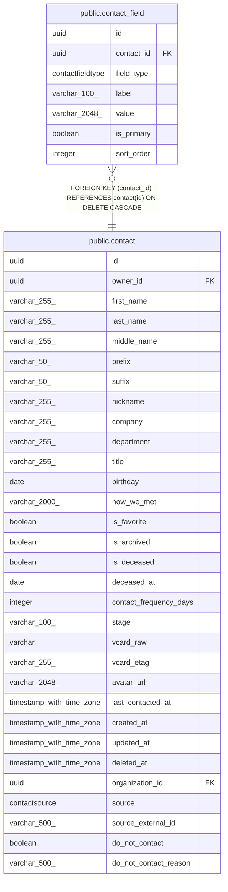

# public.contact_field

## Description

Flexible contact info (emails, phones) attached to a contact.

## Columns

| Name | Type | Default | Nullable | Children | Parents | Comment |
| ---- | ---- | ------- | -------- | -------- | ------- | ------- |
| id | uuid |  | false |  |  | Primary key. |
| contact_id | uuid |  | false |  | [public.contact](public.contact.md) | Parent contact; cascades on delete. |
| field_type | contactfieldtype |  | false |  |  | Kind of contact info (email or phone). |
| label | varchar(100) |  | false |  |  | Label like "home", "work", "cell", "twitter". |
| value | varchar(2048) |  | false |  |  | The actual email address, phone number, etc. |
| is_primary | boolean |  | false |  |  | Marks the primary entry for this field_type on the contact. |
| sort_order | integer |  | false |  |  | Display order within the same field_type. |

## Constraints

| Name | Type | Definition |
| ---- | ---- | ---------- |
| contact_field_contact_id_not_null | n | NOT NULL contact_id |
| contact_field_field_type_not_null | n | NOT NULL field_type |
| contact_field_id_not_null | n | NOT NULL id |
| contact_field_is_primary_not_null | n | NOT NULL is_primary |
| contact_field_label_not_null | n | NOT NULL label |
| contact_field_sort_order_not_null | n | NOT NULL sort_order |
| contact_field_value_not_null | n | NOT NULL value |
| contact_field_contact_id_fkey | FOREIGN KEY | FOREIGN KEY (contact_id) REFERENCES contact(id) ON DELETE CASCADE |
| contact_field_pkey | PRIMARY KEY | PRIMARY KEY (id) |

## Indexes

| Name | Definition |
| ---- | ---------- |
| contact_field_pkey | CREATE UNIQUE INDEX contact_field_pkey ON public.contact_field USING btree (id) |
| ix_contact_field_contact_id | CREATE INDEX ix_contact_field_contact_id ON public.contact_field USING btree (contact_id) |
| ix_contact_field_field_type | CREATE INDEX ix_contact_field_field_type ON public.contact_field USING btree (field_type) |

## Relations

---

> Generated by [tbls](https://github.com/k1LoW/tbls)
