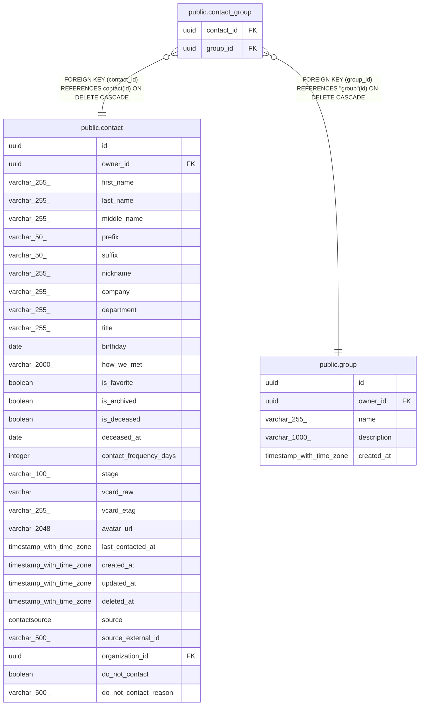

# public.contact_group

## Description

Many-to-many link between contacts and groups.

## Columns

| Name | Type | Default | Nullable | Children | Parents | Comment |
| ---- | ---- | ------- | -------- | -------- | ------- | ------- |
| contact_id | uuid |  | false |  | [public.contact](public.contact.md) | Contact side of the link; cascades on delete. |
| group_id | uuid |  | false |  | [public.group](public.group.md) | Group side of the link; cascades on delete. |

## Constraints

| Name | Type | Definition |
| ---- | ---- | ---------- |
| contact_group_contact_id_not_null | n | NOT NULL contact_id |
| contact_group_group_id_not_null | n | NOT NULL group_id |
| contact_group_group_id_fkey | FOREIGN KEY | FOREIGN KEY (group_id) REFERENCES "group"(id) ON DELETE CASCADE |
| contact_group_contact_id_fkey | FOREIGN KEY | FOREIGN KEY (contact_id) REFERENCES contact(id) ON DELETE CASCADE |
| contact_group_pkey | PRIMARY KEY | PRIMARY KEY (contact_id, group_id) |

## Indexes

| Name | Definition |
| ---- | ---------- |
| contact_group_pkey | CREATE UNIQUE INDEX contact_group_pkey ON public.contact_group USING btree (contact_id, group_id) |

## Relations

---

> Generated by [tbls](https://github.com/k1LoW/tbls)
