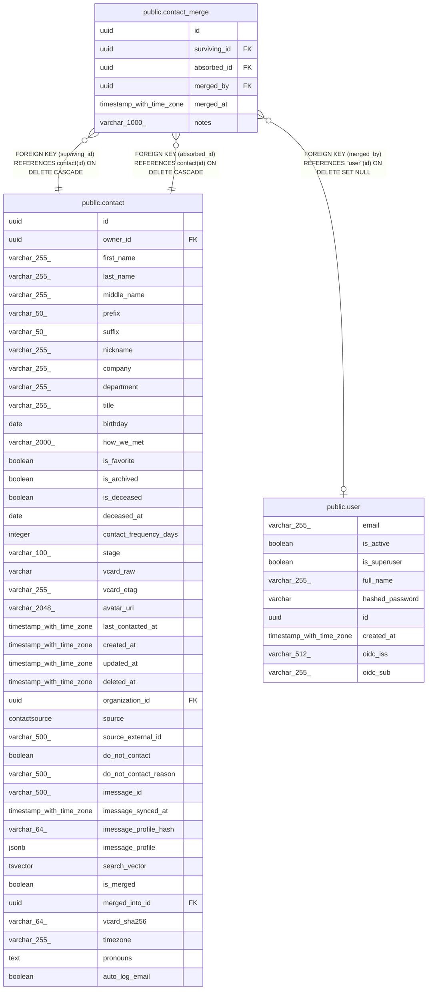

# public.contact_merge

## Columns

| Name | Type | Default | Nullable | Children | Parents | Comment |
| ---- | ---- | ------- | -------- | -------- | ------- | ------- |
| id | uuid |  | false |  |  |  |
| surviving_id | uuid |  | false |  | [public.contact](public.contact.md) |  |
| absorbed_id | uuid |  | false |  | [public.contact](public.contact.md) |  |
| merged_by | uuid |  | true |  | [public.user](public.user.md) |  |
| merged_at | timestamp with time zone | now() | false |  |  |  |
| notes | varchar(1000) |  | true |  |  |  |

## Constraints

| Name | Type | Definition |
| ---- | ---- | ---------- |
| contact_merge_absorbed_id_not_null | n | NOT NULL absorbed_id |
| contact_merge_id_not_null | n | NOT NULL id |
| contact_merge_merged_at_not_null | n | NOT NULL merged_at |
| contact_merge_surviving_id_not_null | n | NOT NULL surviving_id |
| contact_merge_merged_by_fkey | FOREIGN KEY | FOREIGN KEY (merged_by) REFERENCES "user"(id) ON DELETE SET NULL |
| contact_merge_absorbed_id_fkey | FOREIGN KEY | FOREIGN KEY (absorbed_id) REFERENCES contact(id) ON DELETE CASCADE |
| contact_merge_surviving_id_fkey | FOREIGN KEY | FOREIGN KEY (surviving_id) REFERENCES contact(id) ON DELETE CASCADE |
| contact_merge_pkey | PRIMARY KEY | PRIMARY KEY (id) |

## Indexes

| Name | Definition |
| ---- | ---------- |
| contact_merge_pkey | CREATE UNIQUE INDEX contact_merge_pkey ON public.contact_merge USING btree (id) |
| ix_contact_merge_absorbed_id | CREATE UNIQUE INDEX ix_contact_merge_absorbed_id ON public.contact_merge USING btree (absorbed_id) |
| ix_contact_merge_surviving_id | CREATE INDEX ix_contact_merge_surviving_id ON public.contact_merge USING btree (surviving_id) |
| ix_contact_merge_merged_at | CREATE INDEX ix_contact_merge_merged_at ON public.contact_merge USING btree (merged_at) |
| ix_contact_merge_surviving_absorbed | CREATE INDEX ix_contact_merge_surviving_absorbed ON public.contact_merge USING btree (surviving_id, absorbed_id) |

## Relations

---

> Generated by [tbls](https://github.com/k1LoW/tbls)
