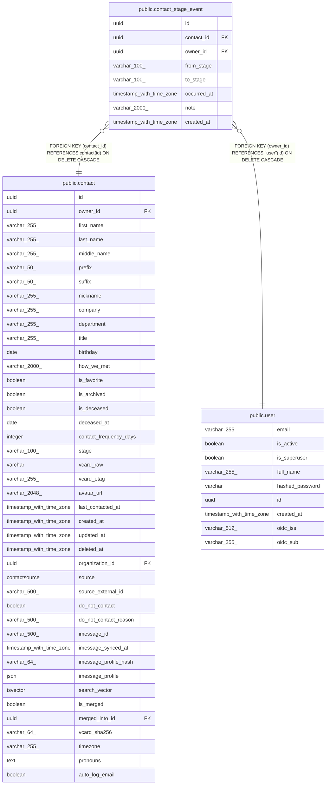

# public.contact_stage_event

## Columns

| Name | Type | Default | Nullable | Children | Parents | Comment |
| ---- | ---- | ------- | -------- | -------- | ------- | ------- |
| id | uuid |  | false |  |  |  |
| contact_id | uuid |  | false |  | [public.contact](public.contact.md) |  |
| owner_id | uuid |  | false |  | [public.user](public.user.md) |  |
| from_stage | varchar(100) |  | true |  |  |  |
| to_stage | varchar(100) |  | true |  |  |  |
| occurred_at | timestamp with time zone |  | false |  |  |  |
| note | varchar(2000) |  | true |  |  |  |
| created_at | timestamp with time zone |  | false |  |  |  |

## Constraints

| Name | Type | Definition |
| ---- | ---- | ---------- |
| contact_stage_event_contact_id_not_null | n | NOT NULL contact_id |
| contact_stage_event_created_at_not_null | n | NOT NULL created_at |
| contact_stage_event_id_not_null | n | NOT NULL id |
| contact_stage_event_occurred_at_not_null | n | NOT NULL occurred_at |
| contact_stage_event_owner_id_not_null | n | NOT NULL owner_id |
| contact_stage_event_owner_id_fkey | FOREIGN KEY | FOREIGN KEY (owner_id) REFERENCES "user"(id) ON DELETE CASCADE |
| contact_stage_event_contact_id_fkey | FOREIGN KEY | FOREIGN KEY (contact_id) REFERENCES contact(id) ON DELETE CASCADE |
| contact_stage_event_pkey | PRIMARY KEY | PRIMARY KEY (id) |

## Indexes

| Name | Definition |
| ---- | ---------- |
| contact_stage_event_pkey | CREATE UNIQUE INDEX contact_stage_event_pkey ON public.contact_stage_event USING btree (id) |
| ix_contact_stage_event_contact_id | CREATE INDEX ix_contact_stage_event_contact_id ON public.contact_stage_event USING btree (contact_id) |
| ix_contact_stage_event_owner_id | CREATE INDEX ix_contact_stage_event_owner_id ON public.contact_stage_event USING btree (owner_id) |
| ix_contact_stage_event_occurred_at | CREATE INDEX ix_contact_stage_event_occurred_at ON public.contact_stage_event USING btree (occurred_at) |

## Relations

---

> Generated by [tbls](https://github.com/k1LoW/tbls)
