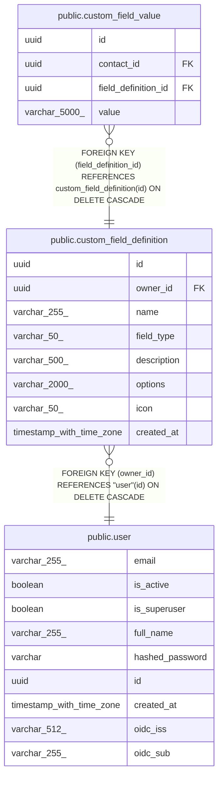

# public.custom_field_definition

## Description

User-defined custom field schema, scoped to one owner.

## Columns

| Name | Type | Default | Nullable | Children | Parents | Comment |
| ---- | ---- | ------- | -------- | -------- | ------- | ------- |
| id | uuid |  | false | [public.custom_field_value](public.custom_field_value.md) |  | Primary key. |
| owner_id | uuid |  | false |  | [public.user](public.user.md) | Owner user; cascades on delete. |
| name | varchar(255) |  | false |  |  | Custom field name shown in the UI. |
| field_type | varchar(50) |  | false |  |  | Field type: text, number, date, boolean, or select. |
| description | varchar(500) |  | true |  |  | Help text displayed alongside the field in the UI. |
| options | varchar(2000) |  | true |  |  | Comma-separated options for field_type="select". |
| icon | varchar(50) |  | true |  |  | Icon slug for the UI (e.g. "heart", "book"). |
| created_at | timestamp with time zone |  | false |  |  | When the definition was created (UTC). |

## Constraints

| Name | Type | Definition |
| ---- | ---- | ---------- |
| custom_field_definition_created_at_not_null | n | NOT NULL created_at |
| custom_field_definition_field_type_not_null | n | NOT NULL field_type |
| custom_field_definition_id_not_null | n | NOT NULL id |
| custom_field_definition_name_not_null | n | NOT NULL name |
| custom_field_definition_owner_id_not_null | n | NOT NULL owner_id |
| custom_field_definition_owner_id_fkey | FOREIGN KEY | FOREIGN KEY (owner_id) REFERENCES "user"(id) ON DELETE CASCADE |
| custom_field_definition_pkey | PRIMARY KEY | PRIMARY KEY (id) |

## Indexes

| Name | Definition |
| ---- | ---------- |
| custom_field_definition_pkey | CREATE UNIQUE INDEX custom_field_definition_pkey ON public.custom_field_definition USING btree (id) |
| ix_custom_field_definition_owner_id | CREATE INDEX ix_custom_field_definition_owner_id ON public.custom_field_definition USING btree (owner_id) |

## Relations

---

> Generated by [tbls](https://github.com/k1LoW/tbls)
