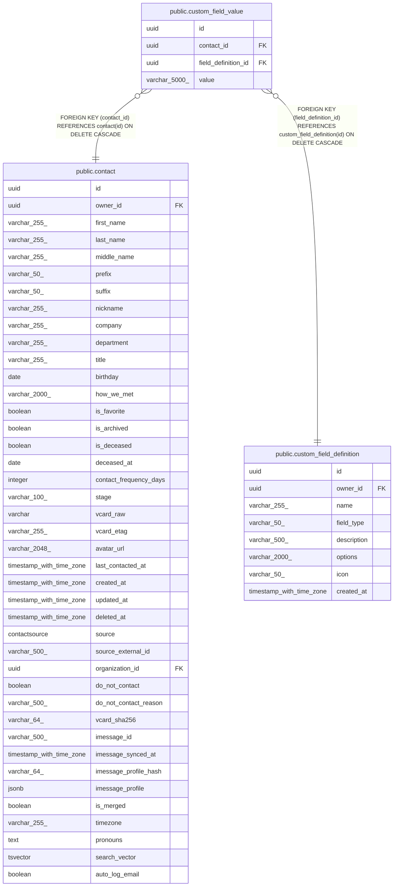

# public.custom_field_value

## Description

Value of a custom field for a specific contact (one per contact per definition).

## Columns

| Name | Type | Default | Nullable | Children | Parents | Comment |
| ---- | ---- | ------- | -------- | -------- | ------- | ------- |
| id | uuid |  | false |  |  | Primary key. |
| contact_id | uuid |  | false |  | [public.contact](public.contact.md) | Contact this value belongs to; cascades on delete. |
| field_definition_id | uuid |  | false |  | [public.custom_field_definition](public.custom_field_definition.md) | Custom field definition this value instantiates; cascades on delete. |
| value | varchar(5000) |  | false |  |  | Value as a string; coerced from the declared field_type. |

## Constraints

| Name | Type | Definition |
| ---- | ---- | ---------- |
| custom_field_value_contact_id_not_null | n | NOT NULL contact_id |
| custom_field_value_field_definition_id_not_null | n | NOT NULL field_definition_id |
| custom_field_value_id_not_null | n | NOT NULL id |
| custom_field_value_value_not_null | n | NOT NULL value |
| custom_field_value_contact_id_fkey | FOREIGN KEY | FOREIGN KEY (contact_id) REFERENCES contact(id) ON DELETE CASCADE |
| custom_field_value_field_definition_id_fkey | FOREIGN KEY | FOREIGN KEY (field_definition_id) REFERENCES custom_field_definition(id) ON DELETE CASCADE |
| custom_field_value_pkey | PRIMARY KEY | PRIMARY KEY (id) |

## Indexes

| Name | Definition |
| ---- | ---------- |
| custom_field_value_pkey | CREATE UNIQUE INDEX custom_field_value_pkey ON public.custom_field_value USING btree (id) |
| ix_custom_field_value_contact_id | CREATE INDEX ix_custom_field_value_contact_id ON public.custom_field_value USING btree (contact_id) |
| ix_custom_field_value_field_definition_id | CREATE INDEX ix_custom_field_value_field_definition_id ON public.custom_field_value USING btree (field_definition_id) |

## Relations

---

> Generated by [tbls](https://github.com/k1LoW/tbls)
