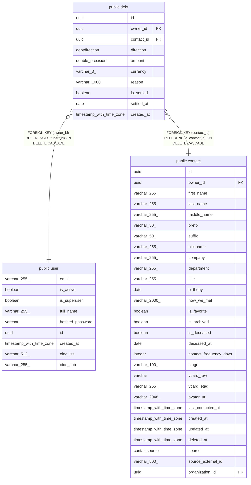

# public.debt

## Description

Money owed to or from a contact.

## Columns

| Name | Type | Default | Nullable | Children | Parents | Comment |
| ---- | ---- | ------- | -------- | -------- | ------- | ------- |
| id | uuid |  | false |  |  | Primary key. |
| owner_id | uuid |  | false |  | [public.user](public.user.md) | Owner user; cascades on delete. |
| contact_id | uuid |  | false |  | [public.contact](public.contact.md) | Contact on the other side of the debt; cascades on delete. |
| direction | debtdirection |  | false |  |  | Who owes whom: i_owe (you owe them) or they_owe (they owe you). |
| amount | double precision |  | false |  |  | Amount owed; must be greater than zero. |
| currency | varchar(3) |  | false |  |  | ISO 4217 currency code. |
| reason | varchar(1000) |  | true |  |  | What the debt is for. |
| is_settled | boolean |  | false |  |  | Marked paid off. |
| settled_at | date |  | true |  |  | Date the debt was settled. |
| created_at | timestamp with time zone |  | false |  |  | When the debt was recorded (UTC). |

## Constraints

| Name | Type | Definition |
| ---- | ---- | ---------- |
| debt_amount_not_null | n | NOT NULL amount |
| debt_contact_id_not_null | n | NOT NULL contact_id |
| debt_created_at_not_null | n | NOT NULL created_at |
| debt_currency_not_null | n | NOT NULL currency |
| debt_direction_not_null | n | NOT NULL direction |
| debt_id_not_null | n | NOT NULL id |
| debt_is_settled_not_null | n | NOT NULL is_settled |
| debt_owner_id_not_null | n | NOT NULL owner_id |
| debt_owner_id_fkey | FOREIGN KEY | FOREIGN KEY (owner_id) REFERENCES "user"(id) ON DELETE CASCADE |
| debt_contact_id_fkey | FOREIGN KEY | FOREIGN KEY (contact_id) REFERENCES contact(id) ON DELETE CASCADE |
| debt_pkey | PRIMARY KEY | PRIMARY KEY (id) |

## Indexes

| Name | Definition |
| ---- | ---------- |
| debt_pkey | CREATE UNIQUE INDEX debt_pkey ON public.debt USING btree (id) |
| ix_debt_contact_id | CREATE INDEX ix_debt_contact_id ON public.debt USING btree (contact_id) |
| ix_debt_owner_id | CREATE INDEX ix_debt_owner_id ON public.debt USING btree (owner_id) |
| ix_debt_is_settled | CREATE INDEX ix_debt_is_settled ON public.debt USING btree (is_settled) |

## Relations

---

> Generated by [tbls](https://github.com/k1LoW/tbls)
