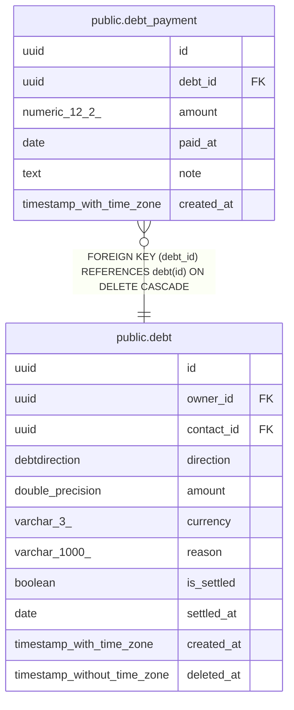

# public.debt_payment

## Columns

| Name | Type | Default | Nullable | Children | Parents | Comment |
| ---- | ---- | ------- | -------- | -------- | ------- | ------- |
| id | uuid |  | false |  |  |  |
| debt_id | uuid |  | false |  | [public.debt](public.debt.md) |  |
| amount | numeric(12,2) |  | false |  |  |  |
| paid_at | date |  | false |  |  |  |
| note | text |  | true |  |  |  |
| created_at | timestamp with time zone |  | false |  |  |  |

## Constraints

| Name | Type | Definition |
| ---- | ---- | ---------- |
| debt_payment_amount_not_null | n | NOT NULL amount |
| debt_payment_created_at_not_null | n | NOT NULL created_at |
| debt_payment_debt_id_not_null | n | NOT NULL debt_id |
| debt_payment_id_not_null | n | NOT NULL id |
| debt_payment_paid_at_not_null | n | NOT NULL paid_at |
| debt_payment_debt_id_fkey | FOREIGN KEY | FOREIGN KEY (debt_id) REFERENCES debt(id) ON DELETE CASCADE |
| debt_payment_pkey | PRIMARY KEY | PRIMARY KEY (id) |

## Indexes

| Name | Definition |
| ---- | ---------- |
| debt_payment_pkey | CREATE UNIQUE INDEX debt_payment_pkey ON public.debt_payment USING btree (id) |
| ix_debt_payment_debt_id | CREATE INDEX ix_debt_payment_debt_id ON public.debt_payment USING btree (debt_id) |

## Relations

---

> Generated by [tbls](https://github.com/k1LoW/tbls)
