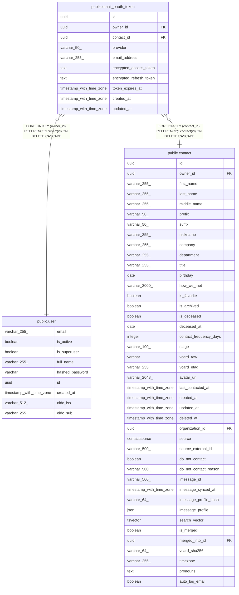

# public.email_oauth_token

## Columns

| Name | Type | Default | Nullable | Children | Parents | Comment |
| ---- | ---- | ------- | -------- | -------- | ------- | ------- |
| id | uuid |  | false |  |  |  |
| owner_id | uuid |  | false |  | [public.user](public.user.md) |  |
| contact_id | uuid |  | false |  | [public.contact](public.contact.md) |  |
| provider | varchar(50) | 'gmail'::character varying | false |  |  |  |
| email_address | varchar(255) |  | false |  |  |  |
| encrypted_access_token | text |  | false |  |  |  |
| encrypted_refresh_token | text |  | true |  |  |  |
| token_expires_at | timestamp with time zone |  | true |  |  |  |
| created_at | timestamp with time zone |  | false |  |  |  |
| updated_at | timestamp with time zone |  | false |  |  |  |

## Constraints

| Name | Type | Definition |
| ---- | ---- | ---------- |
| email_oauth_token_contact_id_not_null | n | NOT NULL contact_id |
| email_oauth_token_created_at_not_null | n | NOT NULL created_at |
| email_oauth_token_email_address_not_null | n | NOT NULL email_address |
| email_oauth_token_encrypted_access_token_not_null | n | NOT NULL encrypted_access_token |
| email_oauth_token_id_not_null | n | NOT NULL id |
| email_oauth_token_owner_id_not_null | n | NOT NULL owner_id |
| email_oauth_token_provider_not_null | n | NOT NULL provider |
| email_oauth_token_updated_at_not_null | n | NOT NULL updated_at |
| email_oauth_token_owner_id_fkey | FOREIGN KEY | FOREIGN KEY (owner_id) REFERENCES "user"(id) ON DELETE CASCADE |
| email_oauth_token_contact_id_fkey | FOREIGN KEY | FOREIGN KEY (contact_id) REFERENCES contact(id) ON DELETE CASCADE |
| email_oauth_token_pkey | PRIMARY KEY | PRIMARY KEY (id) |

## Indexes

| Name | Definition |
| ---- | ---------- |
| email_oauth_token_pkey | CREATE UNIQUE INDEX email_oauth_token_pkey ON public.email_oauth_token USING btree (id) |
| ix_email_oauth_token_owner_id | CREATE INDEX ix_email_oauth_token_owner_id ON public.email_oauth_token USING btree (owner_id) |
| ix_email_oauth_token_contact_id | CREATE INDEX ix_email_oauth_token_contact_id ON public.email_oauth_token USING btree (contact_id) |
| ix_email_oauth_token_email_address | CREATE INDEX ix_email_oauth_token_email_address ON public.email_oauth_token USING btree (email_address) |

## Relations

---

> Generated by [tbls](https://github.com/k1LoW/tbls)
