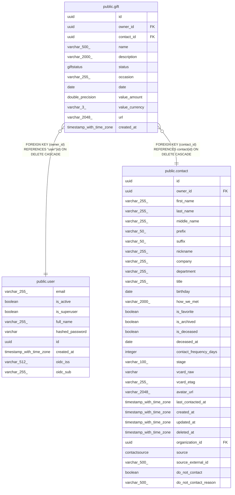

# public.gift

## Description

Gift idea or record for a contact.

## Columns

| Name | Type | Default | Nullable | Children | Parents | Comment |
| ---- | ---- | ------- | -------- | -------- | ------- | ------- |
| id | uuid |  | false |  |  | Primary key. |
| owner_id | uuid |  | false |  | [public.user](public.user.md) | Owner user; cascades on delete. |
| contact_id | uuid |  | false |  | [public.contact](public.contact.md) | Contact the gift is for; cascades on delete. |
| name | varchar(500) |  | false |  |  | Gift name. |
| description | varchar(2000) |  | true |  |  | Details about the gift. |
| status | giftstatus |  | false |  |  | Lifecycle: idea, given, or received. |
| occasion | varchar(255) |  | true |  |  | Occasion like Birthday, Christmas, Housewarming. |
| date | date |  | true |  |  | When the gift was given or received (stored in the `date` column). |
| value_amount | double precision |  | true |  |  | Monetary cost or value. |
| value_currency | varchar(3) |  | false |  |  | ISO 4217 currency code. |
| url | varchar(2048) |  | true |  |  | Link to the product page (e.g. Amazon). |
| created_at | timestamp with time zone |  | false |  |  | When the gift record was created (UTC). |

## Constraints

| Name | Type | Definition |
| ---- | ---- | ---------- |
| gift_contact_id_not_null | n | NOT NULL contact_id |
| gift_created_at_not_null | n | NOT NULL created_at |
| gift_id_not_null | n | NOT NULL id |
| gift_name_not_null | n | NOT NULL name |
| gift_owner_id_not_null | n | NOT NULL owner_id |
| gift_status_not_null | n | NOT NULL status |
| gift_value_currency_not_null | n | NOT NULL value_currency |
| gift_owner_id_fkey | FOREIGN KEY | FOREIGN KEY (owner_id) REFERENCES "user"(id) ON DELETE CASCADE |
| gift_contact_id_fkey | FOREIGN KEY | FOREIGN KEY (contact_id) REFERENCES contact(id) ON DELETE CASCADE |
| gift_pkey | PRIMARY KEY | PRIMARY KEY (id) |

## Indexes

| Name | Definition |
| ---- | ---------- |
| gift_pkey | CREATE UNIQUE INDEX gift_pkey ON public.gift USING btree (id) |
| ix_gift_contact_id | CREATE INDEX ix_gift_contact_id ON public.gift USING btree (contact_id) |
| ix_gift_owner_id | CREATE INDEX ix_gift_owner_id ON public.gift USING btree (owner_id) |
| ix_gift_status | CREATE INDEX ix_gift_status ON public.gift USING btree (status) |

## Relations

---

> Generated by [tbls](https://github.com/k1LoW/tbls)
