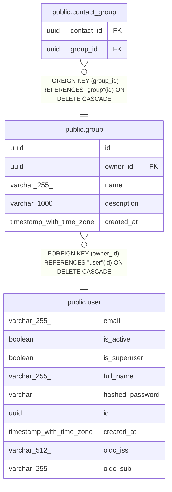

# public.group

## Description

Named collection of contacts (e.g. 'Family', 'Work Team').

## Columns

| Name | Type | Default | Nullable | Children | Parents | Comment |
| ---- | ---- | ------- | -------- | -------- | ------- | ------- |
| id | uuid |  | false | [public.contact_group](public.contact_group.md) |  | Primary key. |
| owner_id | uuid |  | false |  | [public.user](public.user.md) | Owner user; cascades on delete. |
| name | varchar(255) |  | false |  |  | Group name, 1-255 chars. |
| description | varchar(1000) |  | true |  |  | Optional group description. |
| created_at | timestamp with time zone |  | false |  |  | When the group was created (UTC). |

## Constraints

| Name | Type | Definition |
| ---- | ---- | ---------- |
| group_created_at_not_null | n | NOT NULL created_at |
| group_id_not_null | n | NOT NULL id |
| group_name_not_null | n | NOT NULL name |
| group_owner_id_not_null | n | NOT NULL owner_id |
| group_owner_id_fkey | FOREIGN KEY | FOREIGN KEY (owner_id) REFERENCES "user"(id) ON DELETE CASCADE |
| group_pkey | PRIMARY KEY | PRIMARY KEY (id) |

## Indexes

| Name | Definition |
| ---- | ---------- |
| group_pkey | CREATE UNIQUE INDEX group_pkey ON public."group" USING btree (id) |
| ix_group_owner_id | CREATE INDEX ix_group_owner_id ON public."group" USING btree (owner_id) |

## Relations

---

> Generated by [tbls](https://github.com/k1LoW/tbls)
