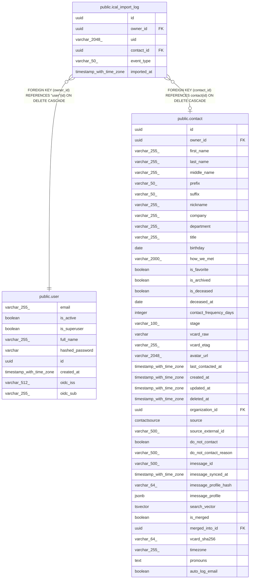

# public.ical_import_log

## Columns

| Name | Type | Default | Nullable | Children | Parents | Comment |
| ---- | ---- | ------- | -------- | -------- | ------- | ------- |
| id | uuid |  | false |  |  |  |
| owner_id | uuid |  | false |  | [public.user](public.user.md) |  |
| uid | varchar(2048) |  | false |  |  |  |
| contact_id | uuid |  | true |  | [public.contact](public.contact.md) |  |
| event_type | varchar(50) |  | false |  |  |  |
| imported_at | timestamp with time zone |  | false |  |  |  |

## Constraints

| Name | Type | Definition |
| ---- | ---- | ---------- |
| ical_import_log_event_type_not_null | n | NOT NULL event_type |
| ical_import_log_id_not_null | n | NOT NULL id |
| ical_import_log_imported_at_not_null | n | NOT NULL imported_at |
| ical_import_log_owner_id_not_null | n | NOT NULL owner_id |
| ical_import_log_uid_not_null | n | NOT NULL uid |
| ical_import_log_owner_id_fkey | FOREIGN KEY | FOREIGN KEY (owner_id) REFERENCES "user"(id) ON DELETE CASCADE |
| ical_import_log_contact_id_fkey | FOREIGN KEY | FOREIGN KEY (contact_id) REFERENCES contact(id) ON DELETE CASCADE |
| ical_import_log_pkey | PRIMARY KEY | PRIMARY KEY (id) |
| uq_ical_import_owner_uid | UNIQUE | UNIQUE (owner_id, uid) |

## Indexes

| Name | Definition |
| ---- | ---------- |
| ical_import_log_pkey | CREATE UNIQUE INDEX ical_import_log_pkey ON public.ical_import_log USING btree (id) |
| uq_ical_import_owner_uid | CREATE UNIQUE INDEX uq_ical_import_owner_uid ON public.ical_import_log USING btree (owner_id, uid) |
| ix_ical_import_log_owner_id | CREATE INDEX ix_ical_import_log_owner_id ON public.ical_import_log USING btree (owner_id) |
| ix_ical_import_log_uid | CREATE INDEX ix_ical_import_log_uid ON public.ical_import_log USING btree (uid) |

## Relations

---

> Generated by [tbls](https://github.com/k1LoW/tbls)
