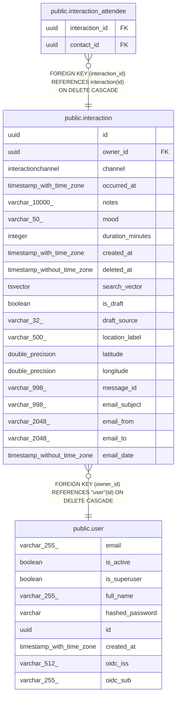

# public.interaction

## Description

Logged touchpoint with one or more contacts (call, meeting, text, etc.). Attendees are attached via interaction_attendee.

## Columns

| Name | Type | Default | Nullable | Children | Parents | Comment |
| ---- | ---- | ------- | -------- | -------- | ------- | ------- |
| id | uuid |  | false | [public.interaction_attendee](public.interaction_attendee.md) |  | Primary key. |
| owner_id | uuid |  | false |  | [public.user](public.user.md) | Owner user; cascades on delete. |
| channel | interactionchannel |  | false |  |  | How the interaction happened (call, in_person, text, etc.). |
| occurred_at | timestamp with time zone |  | false |  |  | When the interaction actually took place. |
| notes | varchar(10000) |  | true |  |  | Conversation summary, action items, etc. |
| mood | varchar(50) |  | true |  |  | Emoji or keyword capturing the tone. |
| duration_minutes | integer |  | true |  |  | Length of the interaction in minutes. |
| created_at | timestamp with time zone |  | false |  |  | When the row was inserted (may be after occurred_at; UTC). |
| deleted_at | timestamp without time zone |  | true |  |  |  |
| search_vector | tsvector |  | true |  |  |  |
| is_draft | boolean |  | false |  |  |  |
| draft_source | varchar(32) |  | true |  |  |  |
| location_label | varchar(500) |  | true |  |  |  |
| latitude | double precision |  | true |  |  |  |
| longitude | double precision |  | true |  |  |  |
| message_id | varchar(998) |  | true |  |  |  |
| email_subject | varchar(998) |  | true |  |  |  |
| email_from | varchar(2048) |  | true |  |  |  |
| email_to | varchar(2048) |  | true |  |  |  |
| email_date | timestamp without time zone |  | true |  |  |  |

## Constraints

| Name | Type | Definition |
| ---- | ---- | ---------- |
| interaction_channel_not_null | n | NOT NULL channel |
| interaction_created_at_not_null | n | NOT NULL created_at |
| interaction_id_not_null | n | NOT NULL id |
| interaction_is_draft_not_null | n | NOT NULL is_draft |
| interaction_occurred_at_not_null | n | NOT NULL occurred_at |
| interaction_owner_id_not_null | n | NOT NULL owner_id |
| interaction_owner_id_fkey | FOREIGN KEY | FOREIGN KEY (owner_id) REFERENCES "user"(id) ON DELETE CASCADE |
| interaction_pkey | PRIMARY KEY | PRIMARY KEY (id) |

## Indexes

| Name | Definition |
| ---- | ---------- |
| interaction_pkey | CREATE UNIQUE INDEX interaction_pkey ON public.interaction USING btree (id) |
| ix_interaction_owner_id | CREATE INDEX ix_interaction_owner_id ON public.interaction USING btree (owner_id) |
| ix_interaction_occurred_at | CREATE INDEX ix_interaction_occurred_at ON public.interaction USING btree (occurred_at) |
| ix_interaction_channel | CREATE INDEX ix_interaction_channel ON public.interaction USING btree (channel) |
| ix_interaction_deleted_at | CREATE INDEX ix_interaction_deleted_at ON public.interaction USING btree (deleted_at) |
| ix_interaction_search_vector | CREATE INDEX ix_interaction_search_vector ON public.interaction USING gin (search_vector) |

## Triggers

| Name | Definition |
| ---- | ---------- |
| tsvectorupdate_interaction | CREATE TRIGGER tsvectorupdate_interaction BEFORE INSERT OR UPDATE ON public.interaction FOR EACH ROW EXECUTE FUNCTION update_interaction_search_vector() |

## Relations

---

> Generated by [tbls](https://github.com/k1LoW/tbls)
