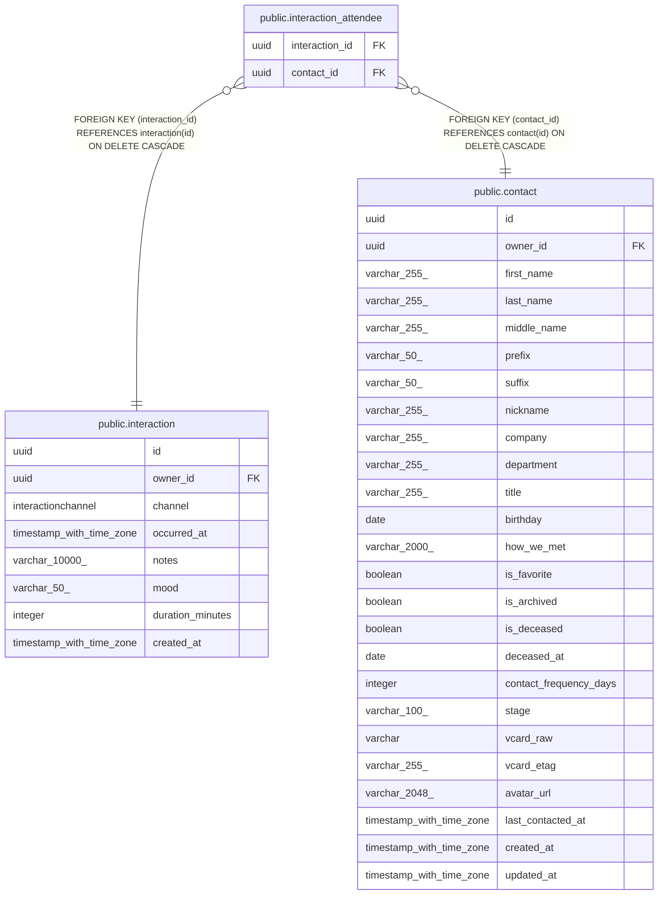

# public.interaction_attendee

## Description

Many-to-many link between interactions and contacts (attendees).

## Columns

| Name | Type | Default | Nullable | Children | Parents | Comment |
| ---- | ---- | ------- | -------- | -------- | ------- | ------- |
| interaction_id | uuid |  | false |  | [public.interaction](public.interaction.md) | Interaction side of the link; cascades on delete. |
| contact_id | uuid |  | false |  | [public.contact](public.contact.md) | Contact side of the link; cascades on delete. |

## Constraints

| Name | Type | Definition |
| ---- | ---- | ---------- |
| interaction_attendee_contact_id_not_null | n | NOT NULL contact_id |
| interaction_attendee_interaction_id_not_null | n | NOT NULL interaction_id |
| interaction_attendee_contact_id_fkey | FOREIGN KEY | FOREIGN KEY (contact_id) REFERENCES contact(id) ON DELETE CASCADE |
| interaction_attendee_interaction_id_fkey | FOREIGN KEY | FOREIGN KEY (interaction_id) REFERENCES interaction(id) ON DELETE CASCADE |
| interaction_attendee_pkey | PRIMARY KEY | PRIMARY KEY (interaction_id, contact_id) |

## Indexes

| Name | Definition |
| ---- | ---------- |
| interaction_attendee_pkey | CREATE UNIQUE INDEX interaction_attendee_pkey ON public.interaction_attendee USING btree (interaction_id, contact_id) |
| ix_interaction_attendee_contact_id | CREATE INDEX ix_interaction_attendee_contact_id ON public.interaction_attendee USING btree (contact_id) |

## Relations

---

> Generated by [tbls](https://github.com/k1LoW/tbls)
