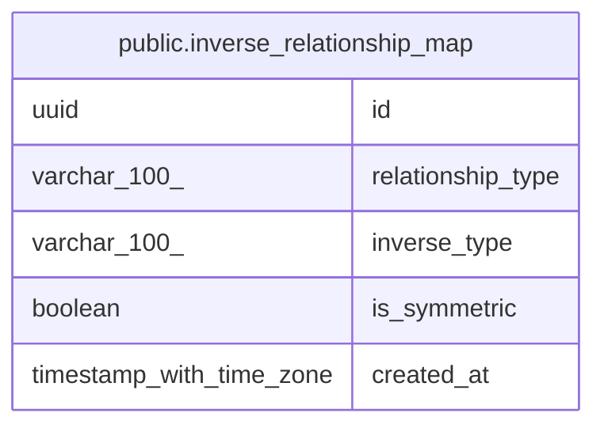

# public.inverse_relationship_map

## Columns

| Name | Type | Default | Nullable | Children | Parents | Comment |
| ---- | ---- | ------- | -------- | -------- | ------- | ------- |
| id | uuid |  | false |  |  |  |
| relationship_type | varchar(100) |  | false |  |  |  |
| inverse_type | varchar(100) |  | false |  |  |  |
| is_symmetric | boolean |  | false |  |  |  |
| created_at | timestamp with time zone | now() | false |  |  |  |

## Constraints

| Name | Type | Definition |
| ---- | ---- | ---------- |
| inverse_relationship_map_created_at_not_null | n | NOT NULL created_at |
| inverse_relationship_map_id_not_null | n | NOT NULL id |
| inverse_relationship_map_inverse_type_not_null | n | NOT NULL inverse_type |
| inverse_relationship_map_is_symmetric_not_null | n | NOT NULL is_symmetric |
| inverse_relationship_map_relationship_type_not_null | n | NOT NULL relationship_type |
| inverse_relationship_map_pkey | PRIMARY KEY | PRIMARY KEY (id) |
| uq_inverse_map_relationship_type | UNIQUE | UNIQUE (relationship_type) |

## Indexes

| Name | Definition |
| ---- | ---------- |
| inverse_relationship_map_pkey | CREATE UNIQUE INDEX inverse_relationship_map_pkey ON public.inverse_relationship_map USING btree (id) |
| uq_inverse_map_relationship_type | CREATE UNIQUE INDEX uq_inverse_map_relationship_type ON public.inverse_relationship_map USING btree (relationship_type) |
| ix_inverse_relationship_map_relationship_type | CREATE INDEX ix_inverse_relationship_map_relationship_type ON public.inverse_relationship_map USING btree (relationship_type) |

## Relations

---

> Generated by [tbls](https://github.com/k1LoW/tbls)
