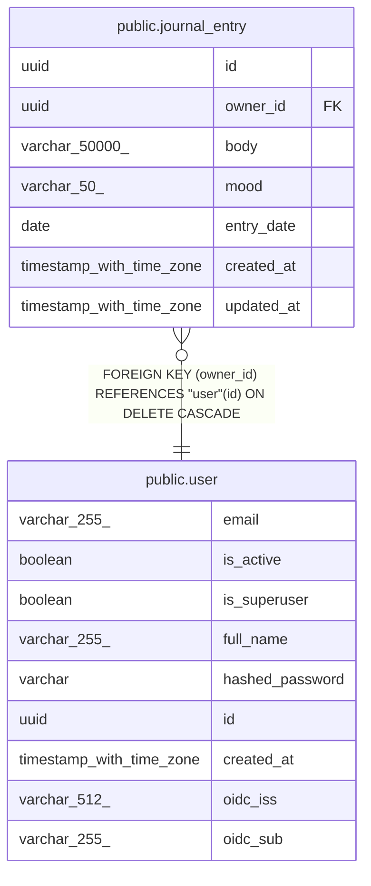

# public.journal_entry

## Description

Personal journal entry, not tied to a specific contact.

## Columns

| Name | Type | Default | Nullable | Children | Parents | Comment |
| ---- | ---- | ------- | -------- | -------- | ------- | ------- |
| id | uuid |  | false |  |  | Primary key. |
| owner_id | uuid |  | false |  | [public.user](public.user.md) | Owner user; cascades on delete. |
| body | varchar(50000) |  | false |  |  | Entry body, 1-50000 chars. |
| mood | varchar(50) |  | true |  |  | Emoji or keyword capturing the mood. |
| entry_date | date |  | false |  |  | Date the entry is about (may differ from created_at). |
| created_at | timestamp with time zone |  | false |  |  | When the entry was logged (UTC). |
| updated_at | timestamp with time zone |  | false |  |  | Auto-bumped on edit (UTC). |

## Constraints

| Name | Type | Definition |
| ---- | ---- | ---------- |
| journal_entry_body_not_null | n | NOT NULL body |
| journal_entry_created_at_not_null | n | NOT NULL created_at |
| journal_entry_entry_date_not_null | n | NOT NULL entry_date |
| journal_entry_id_not_null | n | NOT NULL id |
| journal_entry_owner_id_not_null | n | NOT NULL owner_id |
| journal_entry_updated_at_not_null | n | NOT NULL updated_at |
| journal_entry_owner_id_fkey | FOREIGN KEY | FOREIGN KEY (owner_id) REFERENCES "user"(id) ON DELETE CASCADE |
| journal_entry_pkey | PRIMARY KEY | PRIMARY KEY (id) |

## Indexes

| Name | Definition |
| ---- | ---------- |
| journal_entry_pkey | CREATE UNIQUE INDEX journal_entry_pkey ON public.journal_entry USING btree (id) |
| ix_journal_entry_owner_id | CREATE INDEX ix_journal_entry_owner_id ON public.journal_entry USING btree (owner_id) |
| ix_journal_entry_entry_date | CREATE INDEX ix_journal_entry_entry_date ON public.journal_entry USING btree (entry_date) |

## Relations

---

> Generated by [tbls](https://github.com/k1LoW/tbls)
