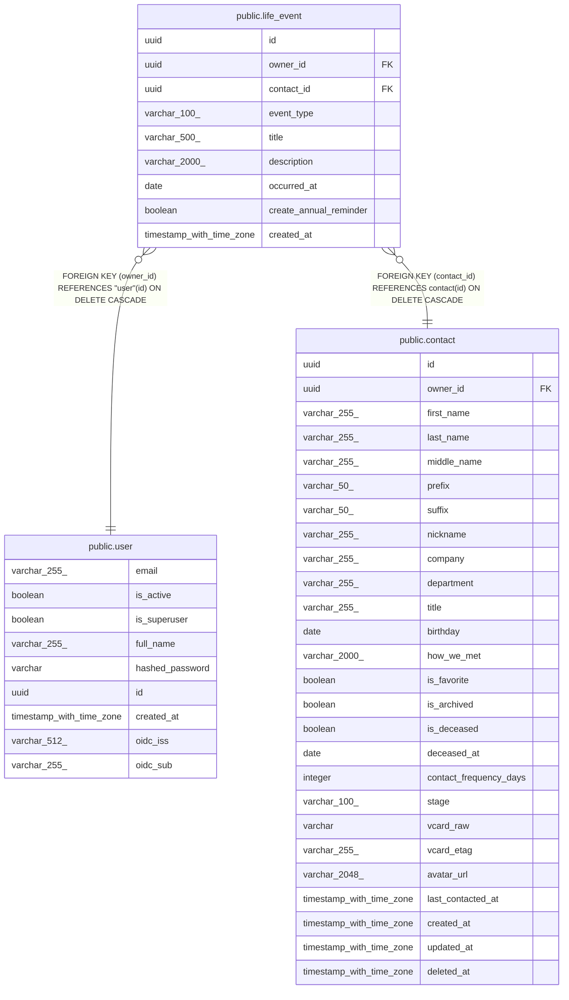

# public.life_event

## Description

Milestone on a contact's timeline (job change, wedding, move, etc.).

## Columns

| Name | Type | Default | Nullable | Children | Parents | Comment |
| ---- | ---- | ------- | -------- | -------- | ------- | ------- |
| id | uuid |  | false |  |  | Primary key. |
| owner_id | uuid |  | false |  | [public.user](public.user.md) | Owner user; cascades on delete. |
| contact_id | uuid |  | false |  | [public.contact](public.contact.md) | Contact the event belongs to; cascades on delete. |
| event_type | varchar(100) |  | false |  |  | Kind of milestone: job_change, move, wedding, baby, graduation, birthday, anniversary, etc. |
| title | varchar(500) |  | false |  |  | Event title. |
| description | varchar(2000) |  | true |  |  | Extra details about the event. |
| occurred_at | date |  | false |  |  | Date the event happened. |
| create_annual_reminder | boolean |  | false |  |  | If true, auto-create a yearly recurring reminder on this date. |
| created_at | timestamp with time zone |  | false |  |  | When the event was logged (UTC). |

## Constraints

| Name | Type | Definition |
| ---- | ---- | ---------- |
| life_event_contact_id_not_null | n | NOT NULL contact_id |
| life_event_create_annual_reminder_not_null | n | NOT NULL create_annual_reminder |
| life_event_created_at_not_null | n | NOT NULL created_at |
| life_event_event_type_not_null | n | NOT NULL event_type |
| life_event_id_not_null | n | NOT NULL id |
| life_event_occurred_at_not_null | n | NOT NULL occurred_at |
| life_event_owner_id_not_null | n | NOT NULL owner_id |
| life_event_title_not_null | n | NOT NULL title |
| life_event_owner_id_fkey | FOREIGN KEY | FOREIGN KEY (owner_id) REFERENCES "user"(id) ON DELETE CASCADE |
| life_event_contact_id_fkey | FOREIGN KEY | FOREIGN KEY (contact_id) REFERENCES contact(id) ON DELETE CASCADE |
| life_event_pkey | PRIMARY KEY | PRIMARY KEY (id) |

## Indexes

| Name | Definition |
| ---- | ---------- |
| life_event_pkey | CREATE UNIQUE INDEX life_event_pkey ON public.life_event USING btree (id) |
| ix_life_event_contact_id | CREATE INDEX ix_life_event_contact_id ON public.life_event USING btree (contact_id) |
| ix_life_event_owner_id | CREATE INDEX ix_life_event_owner_id ON public.life_event USING btree (owner_id) |
| ix_life_event_occurred_at | CREATE INDEX ix_life_event_occurred_at ON public.life_event USING btree (occurred_at) |

## Relations

---

> Generated by [tbls](https://github.com/k1LoW/tbls)
