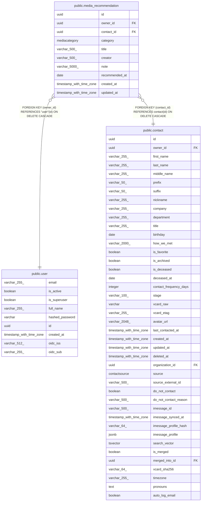

# public.media_recommendation

## Description

Media (book, show, podcast, etc.) recommended to or by a contact.

## Columns

| Name | Type | Default | Nullable | Children | Parents | Comment |
| ---- | ---- | ------- | -------- | -------- | ------- | ------- |
| id | uuid |  | false |  |  | Primary key. |
| owner_id | uuid |  | false |  | [public.user](public.user.md) | Owner user; cascades on delete. |
| contact_id | uuid |  | false |  | [public.contact](public.contact.md) | Contact the recommendation is tied to; cascades on delete. |
| category | mediacategory |  | false |  |  | Media category: movie, tv_show, podcast, musician, book, or other. |
| title | varchar(500) |  | false |  |  | Title of the work. |
| creator | varchar(500) |  | true |  |  | Author, director, artist, or similar creator. |
| note | varchar(5000) |  | true |  |  | Why it was recommended or personal reaction. |
| recommended_at | date |  | true |  |  | Date the recommendation was made. |
| created_at | timestamp with time zone |  | false |  |  | When the recommendation was logged (UTC). |
| updated_at | timestamp with time zone |  | false |  |  | Auto-bumped on edit (UTC). |

## Constraints

| Name | Type | Definition |
| ---- | ---- | ---------- |
| media_recommendation_category_not_null | n | NOT NULL category |
| media_recommendation_contact_id_not_null | n | NOT NULL contact_id |
| media_recommendation_created_at_not_null | n | NOT NULL created_at |
| media_recommendation_id_not_null | n | NOT NULL id |
| media_recommendation_owner_id_not_null | n | NOT NULL owner_id |
| media_recommendation_title_not_null | n | NOT NULL title |
| media_recommendation_updated_at_not_null | n | NOT NULL updated_at |
| media_recommendation_owner_id_fkey | FOREIGN KEY | FOREIGN KEY (owner_id) REFERENCES "user"(id) ON DELETE CASCADE |
| media_recommendation_contact_id_fkey | FOREIGN KEY | FOREIGN KEY (contact_id) REFERENCES contact(id) ON DELETE CASCADE |
| media_recommendation_pkey | PRIMARY KEY | PRIMARY KEY (id) |

## Indexes

| Name | Definition |
| ---- | ---------- |
| media_recommendation_pkey | CREATE UNIQUE INDEX media_recommendation_pkey ON public.media_recommendation USING btree (id) |
| ix_media_recommendation_contact_id | CREATE INDEX ix_media_recommendation_contact_id ON public.media_recommendation USING btree (contact_id) |
| ix_media_recommendation_owner_id | CREATE INDEX ix_media_recommendation_owner_id ON public.media_recommendation USING btree (owner_id) |
| ix_media_recommendation_category | CREATE INDEX ix_media_recommendation_category ON public.media_recommendation USING btree (category) |

## Relations

---

> Generated by [tbls](https://github.com/k1LoW/tbls)
