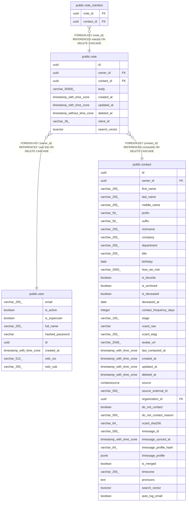

# public.note

## Description

Timestamped freeform note attached to a specific contact.

## Columns

| Name | Type | Default | Nullable | Children | Parents | Comment |
| ---- | ---- | ------- | -------- | -------- | ------- | ------- |
| id | uuid |  | false | [public.note_mention](public.note_mention.md) |  | Primary key. |
| owner_id | uuid |  | false |  | [public.user](public.user.md) | Owner user; cascades on delete. |
| contact_id | uuid |  | false |  | [public.contact](public.contact.md) | Contact the note is attached to; cascades on delete. |
| body | varchar(50000) |  | false |  |  | Note body, 1-50000 chars. |
| created_at | timestamp with time zone |  | false |  |  | When the note was created (UTC). |
| updated_at | timestamp with time zone |  | false |  |  | Auto-bumped on edit (UTC). |
| deleted_at | timestamp without time zone |  | true |  |  |  |
| client_id | varchar(36) |  | true |  |  |  |
| search_vector | tsvector |  | true |  |  |  |

## Constraints

| Name | Type | Definition |
| ---- | ---- | ---------- |
| note_body_not_null | n | NOT NULL body |
| note_contact_id_not_null | n | NOT NULL contact_id |
| note_created_at_not_null | n | NOT NULL created_at |
| note_id_not_null | n | NOT NULL id |
| note_owner_id_not_null | n | NOT NULL owner_id |
| note_updated_at_not_null | n | NOT NULL updated_at |
| note_owner_id_fkey | FOREIGN KEY | FOREIGN KEY (owner_id) REFERENCES "user"(id) ON DELETE CASCADE |
| note_contact_id_fkey | FOREIGN KEY | FOREIGN KEY (contact_id) REFERENCES contact(id) ON DELETE CASCADE |
| note_pkey | PRIMARY KEY | PRIMARY KEY (id) |

## Indexes

| Name | Definition |
| ---- | ---------- |
| note_pkey | CREATE UNIQUE INDEX note_pkey ON public.note USING btree (id) |
| ix_note_contact_id | CREATE INDEX ix_note_contact_id ON public.note USING btree (contact_id) |
| ix_note_owner_id | CREATE INDEX ix_note_owner_id ON public.note USING btree (owner_id) |
| ix_note_created_at | CREATE INDEX ix_note_created_at ON public.note USING btree (created_at) |
| ix_note_deleted_at | CREATE INDEX ix_note_deleted_at ON public.note USING btree (deleted_at) |
| ix_note_client_id | CREATE INDEX ix_note_client_id ON public.note USING btree (client_id) |
| ix_note_search_vector | CREATE INDEX ix_note_search_vector ON public.note USING gin (search_vector) |

## Triggers

| Name | Definition |
| ---- | ---------- |
| tsvectorupdate_note | CREATE TRIGGER tsvectorupdate_note BEFORE INSERT OR UPDATE ON public.note FOR EACH ROW EXECUTE FUNCTION update_note_search_vector() |

## Relations

---

> Generated by [tbls](https://github.com/k1LoW/tbls)
