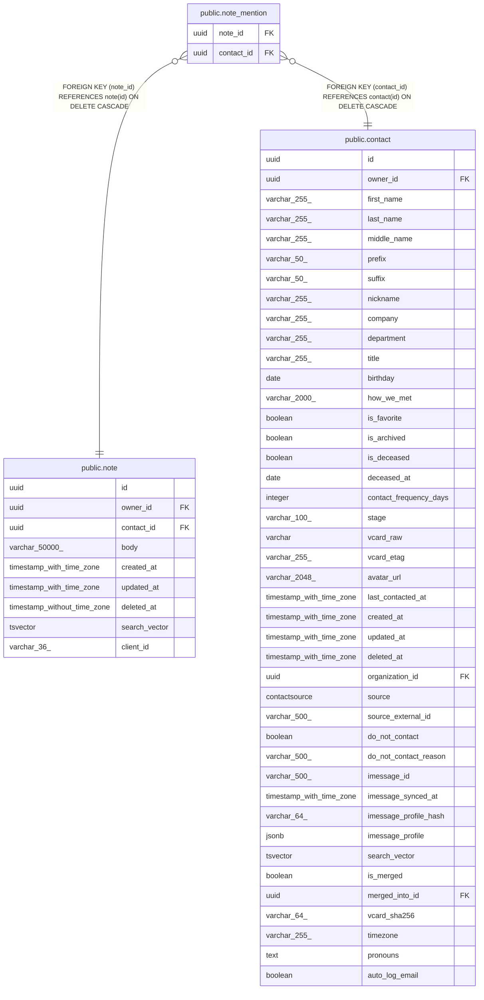

# public.note_mention

## Columns

| Name | Type | Default | Nullable | Children | Parents | Comment |
| ---- | ---- | ------- | -------- | -------- | ------- | ------- |
| note_id | uuid |  | false |  | [public.note](public.note.md) |  |
| contact_id | uuid |  | false |  | [public.contact](public.contact.md) |  |

## Constraints

| Name | Type | Definition |
| ---- | ---- | ---------- |
| note_mention_contact_id_not_null | n | NOT NULL contact_id |
| note_mention_note_id_not_null | n | NOT NULL note_id |
| note_mention_contact_id_fkey | FOREIGN KEY | FOREIGN KEY (contact_id) REFERENCES contact(id) ON DELETE CASCADE |
| note_mention_note_id_fkey | FOREIGN KEY | FOREIGN KEY (note_id) REFERENCES note(id) ON DELETE CASCADE |
| note_mention_pkey | PRIMARY KEY | PRIMARY KEY (note_id, contact_id) |

## Indexes

| Name | Definition |
| ---- | ---------- |
| note_mention_pkey | CREATE UNIQUE INDEX note_mention_pkey ON public.note_mention USING btree (note_id, contact_id) |
| ix_note_mention_contact_id | CREATE INDEX ix_note_mention_contact_id ON public.note_mention USING btree (contact_id) |

## Relations

---

> Generated by [tbls](https://github.com/k1LoW/tbls)
