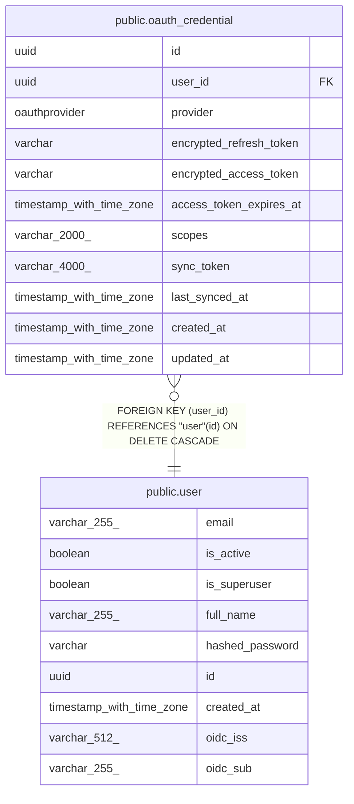

# public.oauth_credential

## Columns

| Name | Type | Default | Nullable | Children | Parents | Comment |
| ---- | ---- | ------- | -------- | -------- | ------- | ------- |
| id | uuid |  | false |  |  |  |
| user_id | uuid |  | false |  | [public.user](public.user.md) |  |
| provider | oauthprovider |  | false |  |  |  |
| encrypted_refresh_token | varchar |  | false |  |  |  |
| encrypted_access_token | varchar |  | true |  |  |  |
| access_token_expires_at | timestamp with time zone |  | true |  |  |  |
| scopes | varchar(2000) | ''::character varying | false |  |  |  |
| sync_token | varchar(4000) |  | true |  |  |  |
| last_synced_at | timestamp with time zone |  | true |  |  |  |
| created_at | timestamp with time zone |  | false |  |  |  |
| updated_at | timestamp with time zone |  | false |  |  |  |

## Constraints

| Name | Type | Definition |
| ---- | ---- | ---------- |
| oauth_credential_created_at_not_null | n | NOT NULL created_at |
| oauth_credential_encrypted_refresh_token_not_null | n | NOT NULL encrypted_refresh_token |
| oauth_credential_id_not_null | n | NOT NULL id |
| oauth_credential_provider_not_null | n | NOT NULL provider |
| oauth_credential_scopes_not_null | n | NOT NULL scopes |
| oauth_credential_updated_at_not_null | n | NOT NULL updated_at |
| oauth_credential_user_id_not_null | n | NOT NULL user_id |
| oauth_credential_user_id_fkey | FOREIGN KEY | FOREIGN KEY (user_id) REFERENCES "user"(id) ON DELETE CASCADE |
| oauth_credential_pkey | PRIMARY KEY | PRIMARY KEY (id) |
| uq_oauth_credential_user_provider | UNIQUE | UNIQUE (user_id, provider) |

## Indexes

| Name | Definition |
| ---- | ---------- |
| oauth_credential_pkey | CREATE UNIQUE INDEX oauth_credential_pkey ON public.oauth_credential USING btree (id) |
| uq_oauth_credential_user_provider | CREATE UNIQUE INDEX uq_oauth_credential_user_provider ON public.oauth_credential USING btree (user_id, provider) |
| ix_oauth_credential_user_id | CREATE INDEX ix_oauth_credential_user_id ON public.oauth_credential USING btree (user_id) |
| ix_oauth_credential_provider | CREATE INDEX ix_oauth_credential_provider ON public.oauth_credential USING btree (provider) |

## Relations

---

> Generated by [tbls](https://github.com/k1LoW/tbls)
