# public.organization

## Columns

| Name | Type | Default | Nullable | Children | Parents | Comment |
| ---- | ---- | ------- | -------- | -------- | ------- | ------- |
| name | varchar(255) |  | false |  |  |  |
| domain | varchar(255) |  | true |  |  |  |
| industry | varchar(255) |  | true |  |  |  |
| notes | varchar(2000) |  | true |  |  |  |
| address_label | varchar(100) |  | false |  |  |  |
| address_street | varchar(500) |  | true |  |  |  |
| address_extended | varchar(500) |  | true |  |  |  |
| address_city | varchar(255) |  | true |  |  |  |
| address_region | varchar(255) |  | true |  |  |  |
| address_postal_code | varchar(50) |  | true |  |  |  |
| address_country | varchar(255) |  | true |  |  |  |
| address_latitude | double precision |  | true |  |  |  |
| address_longitude | double precision |  | true |  |  |  |
| id | uuid |  | false | [public.contact](public.contact.md) |  |  |
| owner_id | uuid |  | false |  | [public.user](public.user.md) |  |
| created_at | timestamp with time zone |  | false |  |  |  |
| updated_at | timestamp with time zone |  | false |  |  |  |

## Constraints

| Name | Type | Definition |
| ---- | ---- | ---------- |
| organization_address_label_not_null | n | NOT NULL address_label |
| organization_created_at_not_null | n | NOT NULL created_at |
| organization_id_not_null | n | NOT NULL id |
| organization_name_not_null | n | NOT NULL name |
| organization_owner_id_not_null | n | NOT NULL owner_id |
| organization_updated_at_not_null | n | NOT NULL updated_at |
| organization_owner_id_fkey | FOREIGN KEY | FOREIGN KEY (owner_id) REFERENCES "user"(id) ON DELETE CASCADE |
| organization_pkey | PRIMARY KEY | PRIMARY KEY (id) |

## Indexes

| Name | Definition |
| ---- | ---------- |
| organization_pkey | CREATE UNIQUE INDEX organization_pkey ON public.organization USING btree (id) |
| ix_organization_owner_id | CREATE INDEX ix_organization_owner_id ON public.organization USING btree (owner_id) |

## Relations

```mermaid
erDiagram

"public.contact" }o--o| "public.organization" : "FOREIGN KEY (organization_id) REFERENCES organization(id) ON DELETE SET NULL"
"public.organization" }o--|| "public.user" : "FOREIGN KEY (owner_id) REFERENCES #quot;user#quot;(id) ON DELETE CASCADE"

"public.organization" {
  varchar_255_ name
  varchar_255_ domain
  varchar_255_ industry
  varchar_2000_ notes
  varchar_100_ address_label
  varchar_500_ address_street
  varchar_500_ address_extended
  varchar_255_ address_city
  varchar_255_ address_region
  varchar_50_ address_postal_code
  varchar_255_ address_country
  double_precision address_latitude
  double_precision address_longitude
  uuid id
  uuid owner_id FK
  timestamp_with_time_zone created_at
  timestamp_with_time_zone updated_at
}
"public.contact" {
  uuid id
  uuid owner_id FK
  varchar_255_ first_name
  varchar_255_ last_name
  varchar_255_ middle_name
  varchar_50_ prefix
  varchar_50_ suffix
  varchar_255_ nickname
  varchar_255_ company
  varchar_255_ department
  varchar_255_ title
  date birthday
  varchar_2000_ how_we_met
  boolean is_favorite
  boolean is_archived
  boolean is_deceased
  date deceased_at
  integer contact_frequency_days
  varchar_100_ stage
  varchar vcard_raw
  varchar_255_ vcard_etag
  varchar_2048_ avatar_url
  timestamp_with_time_zone last_contacted_at
  timestamp_with_time_zone created_at
  timestamp_with_time_zone updated_at
  timestamp_with_time_zone deleted_at
  contactsource source
  varchar_500_ source_external_id
  uuid organization_id FK
  boolean do_not_contact
  varchar_500_ do_not_contact_reason
}
"public.user" {
  varchar_255_ email
  boolean is_active
  boolean is_superuser
  varchar_255_ full_name
  varchar hashed_password
  uuid id
  timestamp_with_time_zone created_at
  varchar_512_ oidc_iss
  varchar_255_ oidc_sub
}
```

---

> Generated by [tbls](https://github.com/k1LoW/tbls)
