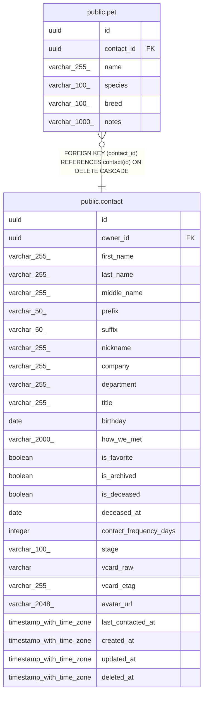

# public.pet

## Description

Pet owned by a contact; useful for memorable conversation hooks.

## Columns

| Name | Type | Default | Nullable | Children | Parents | Comment |
| ---- | ---- | ------- | -------- | -------- | ------- | ------- |
| id | uuid |  | false |  |  | Primary key. |
| contact_id | uuid |  | false |  | [public.contact](public.contact.md) | Owner contact; cascades on delete. |
| name | varchar(255) |  | false |  |  | Pet's name. |
| species | varchar(100) |  | true |  |  | Species like dog, cat, bird. |
| breed | varchar(100) |  | true |  |  | Breed, if known. |
| notes | varchar(1000) |  | true |  |  | Freeform notes (e.g. allergies, birthday). |

## Constraints

| Name | Type | Definition |
| ---- | ---- | ---------- |
| pet_contact_id_not_null | n | NOT NULL contact_id |
| pet_id_not_null | n | NOT NULL id |
| pet_name_not_null | n | NOT NULL name |
| pet_contact_id_fkey | FOREIGN KEY | FOREIGN KEY (contact_id) REFERENCES contact(id) ON DELETE CASCADE |
| pet_pkey | PRIMARY KEY | PRIMARY KEY (id) |

## Indexes

| Name | Definition |
| ---- | ---------- |
| pet_pkey | CREATE UNIQUE INDEX pet_pkey ON public.pet USING btree (id) |
| ix_pet_contact_id | CREATE INDEX ix_pet_contact_id ON public.pet USING btree (contact_id) |

## Relations

---

> Generated by [tbls](https://github.com/k1LoW/tbls)
