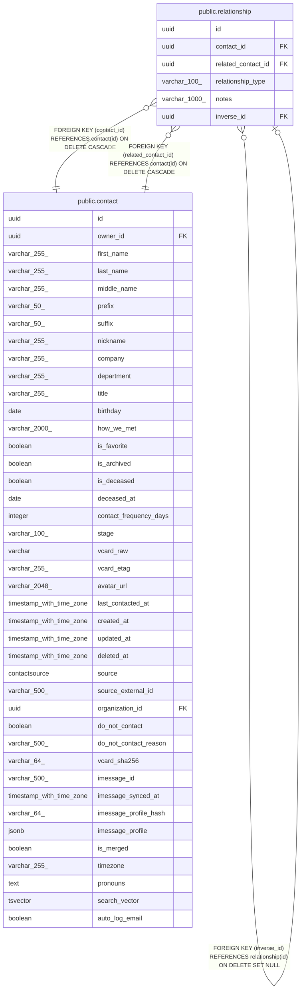

# public.relationship

## Description

Directional link between two contacts (spouse, child, friend, etc.).

## Columns

| Name | Type | Default | Nullable | Children | Parents | Comment |
| ---- | ---- | ------- | -------- | -------- | ------- | ------- |
| id | uuid |  | false | [public.relationship](public.relationship.md) |  | Primary key. |
| contact_id | uuid |  | false |  | [public.contact](public.contact.md) | "From" contact in the directional relationship. |
| related_contact_id | uuid |  | false |  | [public.contact](public.contact.md) | "To" contact in the directional relationship. |
| relationship_type | varchar(100) |  | false |  |  | Kind of relationship: spouse, child, parent, sibling, friend, colleague, etc. |
| notes | varchar(1000) |  | true |  |  | Additional context about the relationship. |
| inverse_id | uuid |  | true |  | [public.relationship](public.relationship.md) |  |

## Constraints

| Name | Type | Definition |
| ---- | ---- | ---------- |
| relationship_contact_id_not_null | n | NOT NULL contact_id |
| relationship_id_not_null | n | NOT NULL id |
| relationship_related_contact_id_not_null | n | NOT NULL related_contact_id |
| relationship_relationship_type_not_null | n | NOT NULL relationship_type |
| relationship_contact_id_fkey | FOREIGN KEY | FOREIGN KEY (contact_id) REFERENCES contact(id) ON DELETE CASCADE |
| relationship_related_contact_id_fkey | FOREIGN KEY | FOREIGN KEY (related_contact_id) REFERENCES contact(id) ON DELETE CASCADE |
| fk_relationship_inverse_id | FOREIGN KEY | FOREIGN KEY (inverse_id) REFERENCES relationship(id) ON DELETE SET NULL |
| relationship_pkey | PRIMARY KEY | PRIMARY KEY (id) |

## Indexes

| Name | Definition |
| ---- | ---------- |
| relationship_pkey | CREATE UNIQUE INDEX relationship_pkey ON public.relationship USING btree (id) |
| ix_relationship_contact_id | CREATE INDEX ix_relationship_contact_id ON public.relationship USING btree (contact_id) |
| ix_relationship_related_contact_id | CREATE INDEX ix_relationship_related_contact_id ON public.relationship USING btree (related_contact_id) |
| ix_relationship_inverse_id | CREATE INDEX ix_relationship_inverse_id ON public.relationship USING btree (inverse_id) |

## Relations

---

> Generated by [tbls](https://github.com/k1LoW/tbls)
