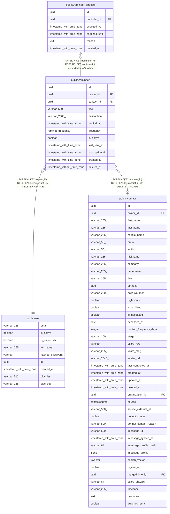

# public.reminder

## Description

Scheduled reminder; contact-specific or standalone.

## Columns

| Name | Type | Default | Nullable | Children | Parents | Comment |
| ---- | ---- | ------- | -------- | -------- | ------- | ------- |
| id | uuid |  | false | [public.reminder_snooze](public.reminder_snooze.md) |  | Primary key. |
| owner_id | uuid |  | false |  | [public.user](public.user.md) | Owner user; cascades on delete. |
| contact_id | uuid |  | true |  | [public.contact](public.contact.md) | Optional contact; null for standalone reminders. |
| title | varchar(500) |  | false |  |  | Reminder title. |
| description | varchar(2000) |  | true |  |  | Extra details shown with the reminder. |
| remind_at | timestamp with time zone |  | false |  |  | When to fire the reminder. |
| frequency | reminderfrequency |  | false |  |  | How often the reminder repeats. |
| is_active | boolean |  | false |  |  | Enable or disable without deleting. |
| last_sent_at | timestamp with time zone |  | true |  |  | When the ARQ worker last fired this reminder. |
| snoozed_until | timestamp with time zone |  | true |  |  | If set, suppress firing until this time. |
| created_at | timestamp with time zone |  | false |  |  | When the reminder was created (UTC). |
| deleted_at | timestamp without time zone |  | true |  |  |  |

## Constraints

| Name | Type | Definition |
| ---- | ---- | ---------- |
| reminder_created_at_not_null | n | NOT NULL created_at |
| reminder_frequency_not_null | n | NOT NULL frequency |
| reminder_id_not_null | n | NOT NULL id |
| reminder_is_active_not_null | n | NOT NULL is_active |
| reminder_owner_id_not_null | n | NOT NULL owner_id |
| reminder_remind_at_not_null | n | NOT NULL remind_at |
| reminder_title_not_null | n | NOT NULL title |
| reminder_owner_id_fkey | FOREIGN KEY | FOREIGN KEY (owner_id) REFERENCES "user"(id) ON DELETE CASCADE |
| reminder_contact_id_fkey | FOREIGN KEY | FOREIGN KEY (contact_id) REFERENCES contact(id) ON DELETE CASCADE |
| reminder_pkey | PRIMARY KEY | PRIMARY KEY (id) |

## Indexes

| Name | Definition |
| ---- | ---------- |
| reminder_pkey | CREATE UNIQUE INDEX reminder_pkey ON public.reminder USING btree (id) |
| ix_reminder_owner_id | CREATE INDEX ix_reminder_owner_id ON public.reminder USING btree (owner_id) |
| ix_reminder_contact_id | CREATE INDEX ix_reminder_contact_id ON public.reminder USING btree (contact_id) |
| ix_reminder_remind_at | CREATE INDEX ix_reminder_remind_at ON public.reminder USING btree (remind_at) |
| ix_reminder_is_active | CREATE INDEX ix_reminder_is_active ON public.reminder USING btree (is_active) |
| ix_reminder_deleted_at | CREATE INDEX ix_reminder_deleted_at ON public.reminder USING btree (deleted_at) |

## Relations

---

> Generated by [tbls](https://github.com/k1LoW/tbls)
