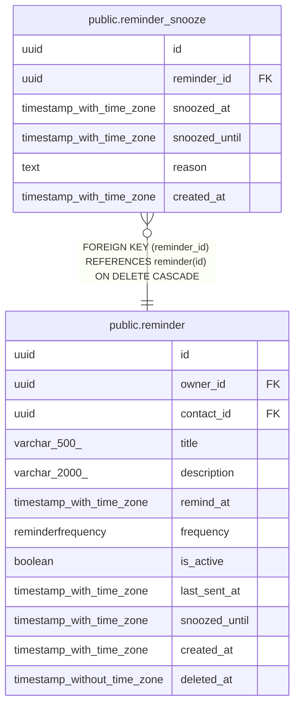

# public.reminder_snooze

## Columns

| Name | Type | Default | Nullable | Children | Parents | Comment |
| ---- | ---- | ------- | -------- | -------- | ------- | ------- |
| id | uuid |  | false |  |  |  |
| reminder_id | uuid |  | false |  | [public.reminder](public.reminder.md) |  |
| snoozed_at | timestamp with time zone | now() | false |  |  |  |
| snoozed_until | timestamp with time zone |  | false |  |  |  |
| reason | text |  | true |  |  |  |
| created_at | timestamp with time zone | now() | false |  |  |  |

## Constraints

| Name | Type | Definition |
| ---- | ---- | ---------- |
| reminder_snooze_created_at_not_null | n | NOT NULL created_at |
| reminder_snooze_id_not_null | n | NOT NULL id |
| reminder_snooze_reminder_id_not_null | n | NOT NULL reminder_id |
| reminder_snooze_snoozed_at_not_null | n | NOT NULL snoozed_at |
| reminder_snooze_snoozed_until_not_null | n | NOT NULL snoozed_until |
| reminder_snooze_reminder_id_fkey | FOREIGN KEY | FOREIGN KEY (reminder_id) REFERENCES reminder(id) ON DELETE CASCADE |
| reminder_snooze_pkey | PRIMARY KEY | PRIMARY KEY (id) |

## Indexes

| Name | Definition |
| ---- | ---------- |
| reminder_snooze_pkey | CREATE UNIQUE INDEX reminder_snooze_pkey ON public.reminder_snooze USING btree (id) |
| ix_reminder_snooze_reminder_id | CREATE INDEX ix_reminder_snooze_reminder_id ON public.reminder_snooze USING btree (reminder_id) |
| ix_reminder_snooze_snoozed_at | CREATE INDEX ix_reminder_snooze_snoozed_at ON public.reminder_snooze USING btree (snoozed_at) |

## Relations

---

> Generated by [tbls](https://github.com/k1LoW/tbls)
