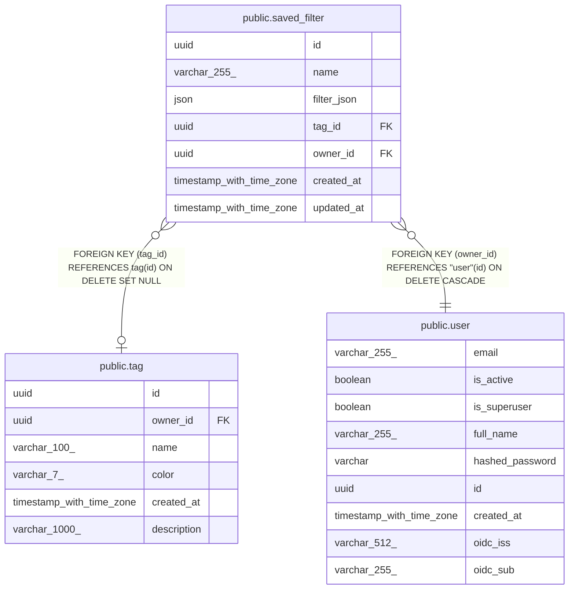

# public.saved_filter

## Columns

| Name | Type | Default | Nullable | Children | Parents | Comment |
| ---- | ---- | ------- | -------- | -------- | ------- | ------- |
| id | uuid |  | false |  |  |  |
| name | varchar(255) |  | false |  |  |  |
| filter_json | json |  | false |  |  |  |
| tag_id | uuid |  | true |  | [public.tag](public.tag.md) |  |
| owner_id | uuid |  | false |  | [public.user](public.user.md) |  |
| created_at | timestamp with time zone |  | false |  |  |  |
| updated_at | timestamp with time zone |  | false |  |  |  |

## Constraints

| Name | Type | Definition |
| ---- | ---- | ---------- |
| saved_filter_created_at_not_null | n | NOT NULL created_at |
| saved_filter_filter_json_not_null | n | NOT NULL filter_json |
| saved_filter_id_not_null | n | NOT NULL id |
| saved_filter_name_not_null | n | NOT NULL name |
| saved_filter_owner_id_not_null | n | NOT NULL owner_id |
| saved_filter_updated_at_not_null | n | NOT NULL updated_at |
| saved_filter_owner_id_fkey | FOREIGN KEY | FOREIGN KEY (owner_id) REFERENCES "user"(id) ON DELETE CASCADE |
| saved_filter_tag_id_fkey | FOREIGN KEY | FOREIGN KEY (tag_id) REFERENCES tag(id) ON DELETE SET NULL |
| saved_filter_pkey | PRIMARY KEY | PRIMARY KEY (id) |

## Indexes

| Name | Definition |
| ---- | ---------- |
| saved_filter_pkey | CREATE UNIQUE INDEX saved_filter_pkey ON public.saved_filter USING btree (id) |
| ix_saved_filter_owner_id | CREATE INDEX ix_saved_filter_owner_id ON public.saved_filter USING btree (owner_id) |

## Relations

---

> Generated by [tbls](https://github.com/k1LoW/tbls)
