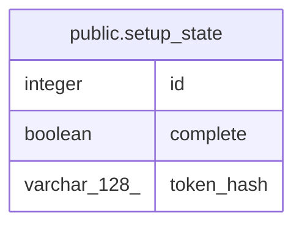

# public.setup_state

## Columns

| Name | Type | Default | Nullable | Children | Parents | Comment |
| ---- | ---- | ------- | -------- | -------- | ------- | ------- |
| id | integer | nextval('setup_state_id_seq'::regclass) | false |  |  |  |
| complete | boolean | false | false |  |  |  |
| token_hash | varchar(128) |  | true |  |  |  |

## Constraints

| Name | Type | Definition |
| ---- | ---- | ---------- |
| setup_state_complete_not_null | n | NOT NULL complete |
| setup_state_id_not_null | n | NOT NULL id |
| setup_state_pkey | PRIMARY KEY | PRIMARY KEY (id) |

## Indexes

| Name | Definition |
| ---- | ---------- |
| setup_state_pkey | CREATE UNIQUE INDEX setup_state_pkey ON public.setup_state USING btree (id) |

## Relations

---

> Generated by [tbls](https://github.com/k1LoW/tbls)
