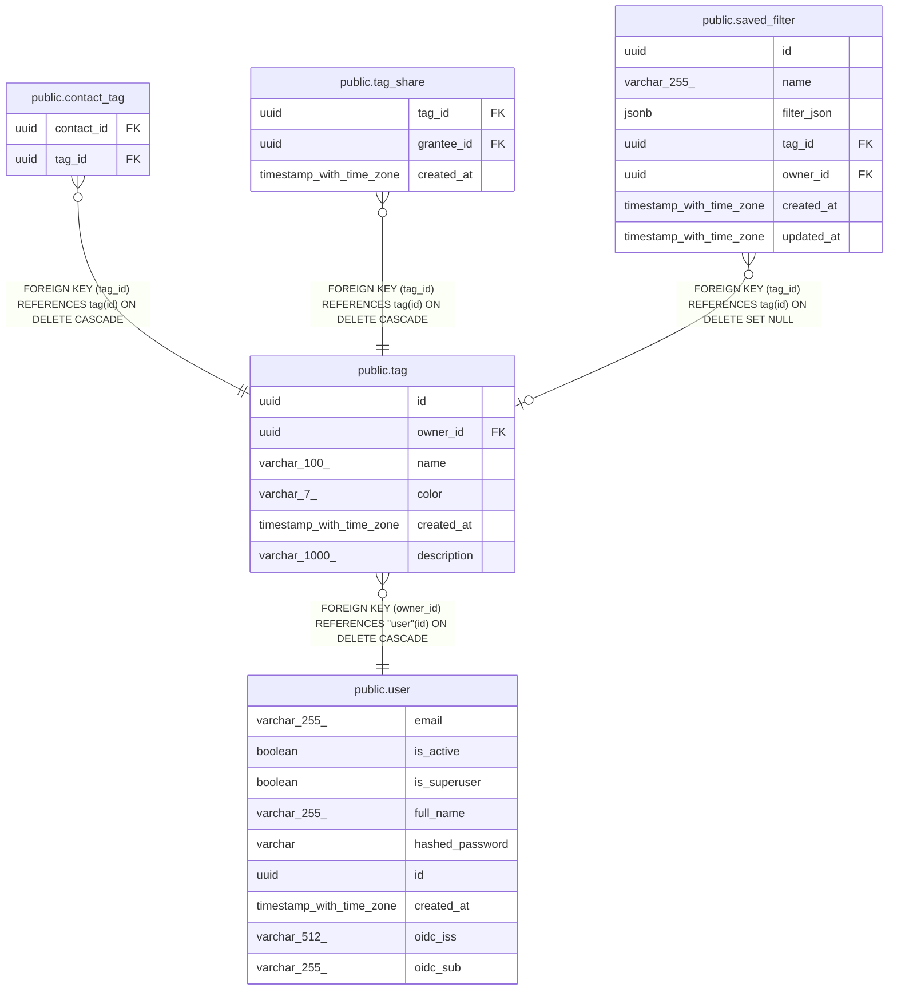

# public.tag

## Description

User-defined tag for grouping contacts.

## Columns

| Name | Type | Default | Nullable | Children | Parents | Comment |
| ---- | ---- | ------- | -------- | -------- | ------- | ------- |
| id | uuid |  | false | [public.contact_tag](public.contact_tag.md) [public.tag_share](public.tag_share.md) [public.saved_filter](public.saved_filter.md) |  | Primary key. |
| owner_id | uuid |  | false |  | [public.user](public.user.md) | Owner user; cascades on delete. |
| name | varchar(100) |  | false |  |  | Tag name, 1-100 chars. |
| color | varchar(7) |  | true |  |  | Optional hex color like #ff0000 for UI display. |
| created_at | timestamp with time zone |  | false |  |  | When the tag was created (UTC). |
| description | varchar(1000) |  | true |  |  |  |

## Constraints

| Name | Type | Definition |
| ---- | ---- | ---------- |
| tag_created_at_not_null | n | NOT NULL created_at |
| tag_id_not_null | n | NOT NULL id |
| tag_name_not_null | n | NOT NULL name |
| tag_owner_id_not_null | n | NOT NULL owner_id |
| tag_owner_id_fkey | FOREIGN KEY | FOREIGN KEY (owner_id) REFERENCES "user"(id) ON DELETE CASCADE |
| tag_pkey | PRIMARY KEY | PRIMARY KEY (id) |

## Indexes

| Name | Definition |
| ---- | ---------- |
| tag_pkey | CREATE UNIQUE INDEX tag_pkey ON public.tag USING btree (id) |
| ix_tag_owner_id | CREATE INDEX ix_tag_owner_id ON public.tag USING btree (owner_id) |

## Relations

---

> Generated by [tbls](https://github.com/k1LoW/tbls)
