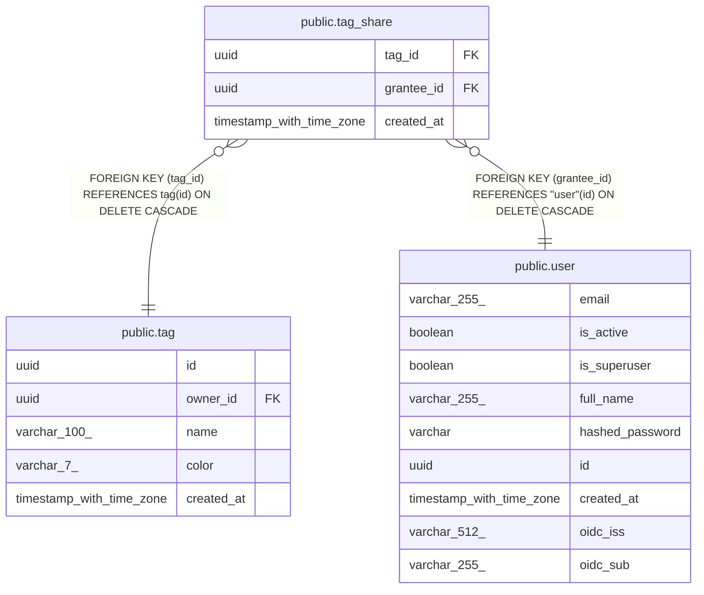

# public.tag_share

## Description

Grants another user read access to all rows bearing a given tag.

## Columns

| Name | Type | Default | Nullable | Children | Parents | Comment |
| ---- | ---- | ------- | -------- | -------- | ------- | ------- |
| tag_id | uuid |  | false |  | [public.tag](public.tag.md) | Tag whose rows are being shared; cascades on delete. |
| grantee_id | uuid |  | false |  | [public.user](public.user.md) | User granted access; cascades on delete. |
| created_at | timestamp with time zone | now() | false |  |  | When the share was granted (UTC). |

## Constraints

| Name | Type | Definition |
| ---- | ---- | ---------- |
| tag_share_created_at_not_null | n | NOT NULL created_at |
| tag_share_grantee_id_not_null | n | NOT NULL grantee_id |
| tag_share_tag_id_not_null | n | NOT NULL tag_id |
| tag_share_grantee_id_fkey | FOREIGN KEY | FOREIGN KEY (grantee_id) REFERENCES "user"(id) ON DELETE CASCADE |
| tag_share_tag_id_fkey | FOREIGN KEY | FOREIGN KEY (tag_id) REFERENCES tag(id) ON DELETE CASCADE |
| tag_share_pkey | PRIMARY KEY | PRIMARY KEY (tag_id, grantee_id) |

## Indexes

| Name | Definition |
| ---- | ---------- |
| tag_share_pkey | CREATE UNIQUE INDEX tag_share_pkey ON public.tag_share USING btree (tag_id, grantee_id) |

## Relations

---

> Generated by [tbls](https://github.com/k1LoW/tbls)
