# public.user

## Description

Authenticated user; tenant-scope owner of every row below.

## Columns

| Name | Type | Default | Nullable | Children | Parents | Comment |
| ---- | ---- | ------- | -------- | -------- | ------- | ------- |
| email | varchar(255) |  | false |  |  | Login email; must be unique. |
| is_active | boolean |  | false |  |  | Whether the account can log in. |
| is_superuser | boolean |  | false |  |  | Grants admin-only endpoints. |
| full_name | varchar(255) |  | true |  |  | Display name; optional. |
| hashed_password | varchar |  | true |  |  | Argon2id hash; null for OIDC-only users. |
| id | uuid |  | false | [public.tag](public.tag.md) [public.contact](public.contact.md) [public.custom_field_definition](public.custom_field_definition.md) [public.interaction](public.interaction.md) [public.reminder](public.reminder.md) [public.gift](public.gift.md) [public.debt](public.debt.md) [public.life_event](public.life_event.md) [public.note](public.note.md) [public.journal_entry](public.journal_entry.md) [public.webhook_endpoint](public.webhook_endpoint.md) [public.tag_share](public.tag_share.md) [public.media_recommendation](public.media_recommendation.md) [public.activity_log](public.activity_log.md) [public.api_key](public.api_key.md) [public.api_key_impersonate](public.api_key_impersonate.md) [public.organization](public.organization.md) [public.contact_merge](public.contact_merge.md) [public.ical_import_log](public.ical_import_log.md) [public.calendar_token](public.calendar_token.md) [public.contact_stage_event](public.contact_stage_event.md) [public.email_oauth_token](public.email_oauth_token.md) [public.saved_filter](public.saved_filter.md) |  | Primary key. |
| created_at | timestamp with time zone |  | true |  |  | When the account was created (UTC). |
| oidc_iss | varchar(512) |  | true |  |  | OIDC issuer URL; paired with oidc_sub forms the unique external identity. |
| oidc_sub | varchar(255) |  | true |  |  | OIDC subject; paired with oidc_iss forms the unique external identity. |

## Constraints

| Name | Type | Definition |
| ---- | ---- | ---------- |
| user_email_not_null | n | NOT NULL email |
| user_is_active_not_null | n | NOT NULL is_active |
| user_is_superuser_not_null | n | NOT NULL is_superuser |
| user_new_id_not_null | n | NOT NULL id |
| user_pkey | PRIMARY KEY | PRIMARY KEY (id) |
| uq_user_oidc_identity | UNIQUE | UNIQUE (oidc_iss, oidc_sub) |

## Indexes

| Name | Definition |
| ---- | ---------- |
| ix_user_email | CREATE UNIQUE INDEX ix_user_email ON public."user" USING btree (email) |
| user_pkey | CREATE UNIQUE INDEX user_pkey ON public."user" USING btree (id) |
| ix_user_oidc_iss | CREATE INDEX ix_user_oidc_iss ON public."user" USING btree (oidc_iss) |
| ix_user_oidc_sub | CREATE INDEX ix_user_oidc_sub ON public."user" USING btree (oidc_sub) |
| uq_user_oidc_identity | CREATE UNIQUE INDEX uq_user_oidc_identity ON public."user" USING btree (oidc_iss, oidc_sub) |

## Relations

```mermaid
erDiagram

"public.tag" }o--|| "public.user" : "FOREIGN KEY (owner_id) REFERENCES #quot;user#quot;(id) ON DELETE CASCADE"
"public.contact" }o--|| "public.user" : "FOREIGN KEY (owner_id) REFERENCES #quot;user#quot;(id) ON DELETE CASCADE"
"public.custom_field_definition" }o--|| "public.user" : "FOREIGN KEY (owner_id) REFERENCES #quot;user#quot;(id) ON DELETE CASCADE"
"public.interaction" }o--|| "public.user" : "FOREIGN KEY (owner_id) REFERENCES #quot;user#quot;(id) ON DELETE CASCADE"
"public.reminder" }o--|| "public.user" : "FOREIGN KEY (owner_id) REFERENCES #quot;user#quot;(id) ON DELETE CASCADE"
"public.gift" }o--|| "public.user" : "FOREIGN KEY (owner_id) REFERENCES #quot;user#quot;(id) ON DELETE CASCADE"
"public.debt" }o--|| "public.user" : "FOREIGN KEY (owner_id) REFERENCES #quot;user#quot;(id) ON DELETE CASCADE"
"public.life_event" }o--|| "public.user" : "FOREIGN KEY (owner_id) REFERENCES #quot;user#quot;(id) ON DELETE CASCADE"
"public.note" }o--|| "public.user" : "FOREIGN KEY (owner_id) REFERENCES #quot;user#quot;(id) ON DELETE CASCADE"
"public.journal_entry" }o--|| "public.user" : "FOREIGN KEY (owner_id) REFERENCES #quot;user#quot;(id) ON DELETE CASCADE"
"public.webhook_endpoint" }o--|| "public.user" : "FOREIGN KEY (owner_id) REFERENCES #quot;user#quot;(id) ON DELETE CASCADE"
"public.tag_share" }o--|| "public.user" : "FOREIGN KEY (grantee_id) REFERENCES #quot;user#quot;(id) ON DELETE CASCADE"
"public.media_recommendation" }o--|| "public.user" : "FOREIGN KEY (owner_id) REFERENCES #quot;user#quot;(id) ON DELETE CASCADE"
"public.activity_log" }o--o| "public.user" : "FOREIGN KEY (actor_id) REFERENCES #quot;user#quot;(id) ON DELETE SET NULL"
"public.activity_log" }o--|| "public.user" : "FOREIGN KEY (owner_id) REFERENCES #quot;user#quot;(id) ON DELETE CASCADE"
"public.api_key" }o--|| "public.user" : "FOREIGN KEY (owned_by_user_id) REFERENCES #quot;user#quot;(id) ON DELETE CASCADE"
"public.api_key_impersonate" }o--|| "public.user" : "FOREIGN KEY (user_id) REFERENCES #quot;user#quot;(id) ON DELETE CASCADE"
"public.organization" }o--|| "public.user" : "FOREIGN KEY (owner_id) REFERENCES #quot;user#quot;(id) ON DELETE CASCADE"
"public.contact_merge" }o--o| "public.user" : "FOREIGN KEY (merged_by) REFERENCES #quot;user#quot;(id) ON DELETE SET NULL"
"public.ical_import_log" }o--|| "public.user" : "FOREIGN KEY (owner_id) REFERENCES #quot;user#quot;(id) ON DELETE CASCADE"
"public.calendar_token" }o--|| "public.user" : "FOREIGN KEY (owner_id) REFERENCES #quot;user#quot;(id) ON DELETE CASCADE"
"public.contact_stage_event" }o--|| "public.user" : "FOREIGN KEY (owner_id) REFERENCES #quot;user#quot;(id) ON DELETE CASCADE"
"public.email_oauth_token" }o--|| "public.user" : "FOREIGN KEY (owner_id) REFERENCES #quot;user#quot;(id) ON DELETE CASCADE"
"public.saved_filter" }o--|| "public.user" : "FOREIGN KEY (owner_id) REFERENCES #quot;user#quot;(id) ON DELETE CASCADE"

"public.user" {
  varchar_255_ email
  boolean is_active
  boolean is_superuser
  varchar_255_ full_name
  varchar hashed_password
  uuid id
  timestamp_with_time_zone created_at
  varchar_512_ oidc_iss
  varchar_255_ oidc_sub
}
"public.tag" {
  uuid id
  uuid owner_id FK
  varchar_100_ name
  varchar_7_ color
  timestamp_with_time_zone created_at
  varchar_1000_ description
}
"public.contact" {
  uuid id
  uuid owner_id FK
  varchar_255_ first_name
  varchar_255_ last_name
  varchar_255_ middle_name
  varchar_50_ prefix
  varchar_50_ suffix
  varchar_255_ nickname
  varchar_255_ company
  varchar_255_ department
  varchar_255_ title
  date birthday
  varchar_2000_ how_we_met
  boolean is_favorite
  boolean is_archived
  boolean is_deceased
  date deceased_at
  integer contact_frequency_days
  varchar_100_ stage
  varchar vcard_raw
  varchar_255_ vcard_etag
  varchar_2048_ avatar_url
  timestamp_with_time_zone last_contacted_at
  timestamp_with_time_zone created_at
  timestamp_with_time_zone updated_at
  timestamp_with_time_zone deleted_at
  contactsource source
  varchar_500_ source_external_id
  uuid organization_id FK
  boolean do_not_contact
  varchar_500_ do_not_contact_reason
  varchar_64_ vcard_sha256
  varchar_500_ imessage_id
  timestamp_with_time_zone imessage_synced_at
  varchar_64_ imessage_profile_hash
  jsonb imessage_profile
  boolean is_merged
  varchar_255_ timezone
  text pronouns
  tsvector search_vector
  boolean auto_log_email
}
"public.custom_field_definition" {
  uuid id
  uuid owner_id FK
  varchar_255_ name
  varchar_50_ field_type
  varchar_500_ description
  varchar_2000_ options
  varchar_50_ icon
  timestamp_with_time_zone created_at
}
"public.interaction" {
  uuid id
  uuid owner_id FK
  interactionchannel channel
  timestamp_with_time_zone occurred_at
  varchar_10000_ notes
  varchar_50_ mood
  integer duration_minutes
  timestamp_with_time_zone created_at
  timestamp_without_time_zone deleted_at
  boolean is_draft
  varchar_32_ draft_source
  varchar_500_ location_label
  double_precision latitude
  double_precision longitude
  tsvector search_vector
  varchar_998_ message_id
  varchar_998_ email_subject
  varchar_2048_ email_from
  varchar_2048_ email_to
  timestamp_without_time_zone email_date
}
"public.reminder" {
  uuid id
  uuid owner_id FK
  uuid contact_id FK
  varchar_500_ title
  varchar_2000_ description
  timestamp_with_time_zone remind_at
  reminderfrequency frequency
  boolean is_active
  timestamp_with_time_zone last_sent_at
  timestamp_with_time_zone snoozed_until
  timestamp_with_time_zone created_at
  timestamp_without_time_zone deleted_at
}
"public.gift" {
  uuid id
  uuid owner_id FK
  uuid contact_id FK
  varchar_500_ name
  varchar_2000_ description
  giftstatus status
  varchar_255_ occasion
  date date
  double_precision value_amount
  varchar_3_ value_currency
  varchar_2048_ url
  timestamp_with_time_zone created_at
  timestamp_without_time_zone deleted_at
}
"public.debt" {
  uuid id
  uuid owner_id FK
  uuid contact_id FK
  debtdirection direction
  double_precision amount
  varchar_3_ currency
  varchar_1000_ reason
  boolean is_settled
  date settled_at
  timestamp_with_time_zone created_at
  timestamp_without_time_zone deleted_at
}
"public.life_event" {
  uuid id
  uuid owner_id FK
  uuid contact_id FK
  varchar_100_ event_type
  varchar_500_ title
  varchar_2000_ description
  date occurred_at
  boolean create_annual_reminder
  timestamp_with_time_zone created_at
  timestamp_without_time_zone deleted_at
}
"public.note" {
  uuid id
  uuid owner_id FK
  uuid contact_id FK
  varchar_50000_ body
  timestamp_with_time_zone created_at
  timestamp_with_time_zone updated_at
  timestamp_without_time_zone deleted_at
  varchar_36_ client_id
  tsvector search_vector
}
"public.journal_entry" {
  uuid id
  uuid owner_id FK
  varchar_50000_ body
  varchar_50_ mood
  date entry_date
  timestamp_with_time_zone created_at
  timestamp_with_time_zone updated_at
  tsvector search_vector
}
"public.webhook_endpoint" {
  uuid id
  uuid owner_id FK
  varchar_255_ name
  varchar_2048_ url
  varchar_10_ direction
  varchar_1000_ event_types
  boolean is_active
  varchar_255_ secret
  varchar_255_ api_key
  timestamp_with_time_zone created_at
}
"public.tag_share" {
  uuid tag_id FK
  uuid grantee_id FK
  timestamp_with_time_zone created_at
}
"public.media_recommendation" {
  uuid id
  uuid owner_id FK
  uuid contact_id FK
  mediacategory category
  varchar_500_ title
  varchar_500_ creator
  varchar_5000_ note
  date recommended_at
  timestamp_with_time_zone created_at
  timestamp_with_time_zone updated_at
}
"public.activity_log" {
  uuid id
  uuid owner_id FK
  uuid actor_id FK
  varchar_64_ entity_type
  uuid entity_id
  varchar_32_ action
  jsonb changes_json
  timestamp_with_time_zone occurred_at
  uuid acting_api_key_id FK
}
"public.api_key" {
  uuid id
  varchar_255_ name
  varchar_64_ key_hash
  varchar_16_ key_prefix
  uuid owned_by_user_id FK
  timestamp_with_time_zone created_at
  timestamp_with_time_zone last_used_at
  timestamp_with_time_zone revoked_at
  timestamp_with_time_zone expires_at
}
"public.api_key_impersonate" {
  uuid api_key_id FK
  uuid user_id FK
}
"public.organization" {
  varchar_255_ name
  varchar_255_ domain
  varchar_255_ industry
  varchar_2000_ notes
  varchar_100_ address_label
  varchar_500_ address_street
  varchar_500_ address_extended
  varchar_255_ address_city
  varchar_255_ address_region
  varchar_50_ address_postal_code
  varchar_255_ address_country
  double_precision address_latitude
  double_precision address_longitude
  uuid id
  uuid owner_id FK
  timestamp_with_time_zone created_at
  timestamp_with_time_zone updated_at
}
"public.contact_merge" {
  uuid id
  uuid surviving_id FK
  uuid absorbed_id FK
  uuid merged_by FK
  timestamp_with_time_zone merged_at
  varchar_1000_ notes
}
"public.ical_import_log" {
  uuid id
  uuid owner_id FK
  varchar_2048_ uid
  uuid contact_id FK
  varchar_50_ event_type
  timestamp_with_time_zone imported_at
}
"public.calendar_token" {
  uuid id
  uuid owner_id FK
  varchar_255_ token
  varchar_20_ status
  timestamp_with_time_zone expires_at
  timestamp_with_time_zone last_used_at
  timestamp_with_time_zone revoked_at
  timestamp_with_time_zone created_at
}
"public.contact_stage_event" {
  uuid id
  uuid contact_id FK
  uuid owner_id FK
  varchar_100_ from_stage
  varchar_100_ to_stage
  timestamp_with_time_zone occurred_at
  varchar_2000_ note
  timestamp_with_time_zone created_at
}
"public.email_oauth_token" {
  uuid id
  uuid owner_id FK
  uuid contact_id FK
  varchar_50_ provider
  varchar_255_ email_address
  text encrypted_access_token
  text encrypted_refresh_token
  timestamp_with_time_zone token_expires_at
  timestamp_with_time_zone created_at
  timestamp_with_time_zone updated_at
}
"public.saved_filter" {
  uuid id
  varchar_255_ name
  jsonb filter_json
  uuid tag_id FK
  uuid owner_id FK
  timestamp_with_time_zone created_at
  timestamp_with_time_zone updated_at
}
```

---

> Generated by [tbls](https://github.com/k1LoW/tbls)
