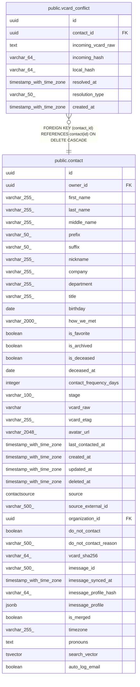

# public.vcard_conflict

## Columns

| Name | Type | Default | Nullable | Children | Parents | Comment |
| ---- | ---- | ------- | -------- | -------- | ------- | ------- |
| id | uuid |  | false |  |  |  |
| contact_id | uuid |  | false |  | [public.contact](public.contact.md) |  |
| incoming_vcard_raw | text |  | false |  |  |  |
| incoming_hash | varchar(64) |  | false |  |  |  |
| local_hash | varchar(64) |  | false |  |  |  |
| resolved_at | timestamp with time zone |  | true |  |  |  |
| resolution_type | varchar(50) |  | true |  |  |  |
| created_at | timestamp with time zone | now() | false |  |  |  |

## Constraints

| Name | Type | Definition |
| ---- | ---- | ---------- |
| vcard_conflict_contact_id_not_null | n | NOT NULL contact_id |
| vcard_conflict_created_at_not_null | n | NOT NULL created_at |
| vcard_conflict_id_not_null | n | NOT NULL id |
| vcard_conflict_incoming_hash_not_null | n | NOT NULL incoming_hash |
| vcard_conflict_incoming_vcard_raw_not_null | n | NOT NULL incoming_vcard_raw |
| vcard_conflict_local_hash_not_null | n | NOT NULL local_hash |
| vcard_conflict_contact_id_fkey | FOREIGN KEY | FOREIGN KEY (contact_id) REFERENCES contact(id) ON DELETE CASCADE |
| vcard_conflict_pkey | PRIMARY KEY | PRIMARY KEY (id) |

## Indexes

| Name | Definition |
| ---- | ---------- |
| vcard_conflict_pkey | CREATE UNIQUE INDEX vcard_conflict_pkey ON public.vcard_conflict USING btree (id) |
| ix_vcard_conflict_contact_id | CREATE INDEX ix_vcard_conflict_contact_id ON public.vcard_conflict USING btree (contact_id) |
| ix_vcard_conflict_resolved_at | CREATE INDEX ix_vcard_conflict_resolved_at ON public.vcard_conflict USING btree (resolved_at) |

## Relations

---

> Generated by [tbls](https://github.com/k1LoW/tbls)
