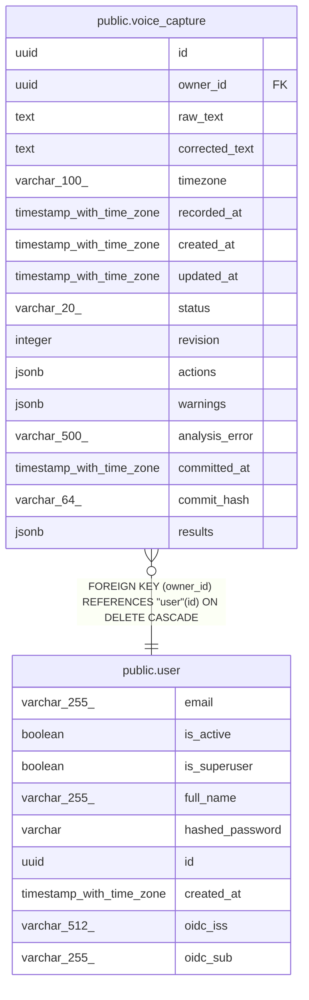

# public.voice_capture

## Columns

| Name | Type | Default | Nullable | Children | Parents | Comment |
| ---- | ---- | ------- | -------- | -------- | ------- | ------- |
| id | uuid |  | false |  |  |  |
| owner_id | uuid |  | false |  | [public.user](public.user.md) |  |
| raw_text | text |  | false |  |  |  |
| corrected_text | text |  | false |  |  |  |
| timezone | varchar(100) |  | false |  |  |  |
| recorded_at | timestamp with time zone |  | false |  |  |  |
| created_at | timestamp with time zone |  | false |  |  |  |
| updated_at | timestamp with time zone |  | false |  |  |  |
| status | varchar(20) | 'draft'::character varying | false |  |  |  |
| revision | integer | 1 | false |  |  |  |
| actions | jsonb | '{}'::jsonb | false |  |  |  |
| warnings | jsonb | '[]'::jsonb | false |  |  |  |
| analysis_error | varchar(500) |  | true |  |  |  |
| committed_at | timestamp with time zone |  | true |  |  |  |
| commit_hash | varchar(64) |  | true |  |  |  |
| results | jsonb |  | true |  |  |  |

## Constraints

| Name | Type | Definition |
| ---- | ---- | ---------- |
| voice_capture_actions_not_null | n | NOT NULL actions |
| voice_capture_corrected_text_not_null | n | NOT NULL corrected_text |
| voice_capture_created_at_not_null | n | NOT NULL created_at |
| voice_capture_id_not_null | n | NOT NULL id |
| voice_capture_owner_id_not_null | n | NOT NULL owner_id |
| voice_capture_raw_text_not_null | n | NOT NULL raw_text |
| voice_capture_recorded_at_not_null | n | NOT NULL recorded_at |
| voice_capture_revision_not_null | n | NOT NULL revision |
| voice_capture_status_not_null | n | NOT NULL status |
| voice_capture_timezone_not_null | n | NOT NULL timezone |
| voice_capture_updated_at_not_null | n | NOT NULL updated_at |
| voice_capture_warnings_not_null | n | NOT NULL warnings |
| voice_capture_owner_id_fkey | FOREIGN KEY | FOREIGN KEY (owner_id) REFERENCES "user"(id) ON DELETE CASCADE |
| voice_capture_pkey | PRIMARY KEY | PRIMARY KEY (id) |

## Indexes

| Name | Definition |
| ---- | ---------- |
| voice_capture_pkey | CREATE UNIQUE INDEX voice_capture_pkey ON public.voice_capture USING btree (id) |
| ix_voice_capture_owner_id | CREATE INDEX ix_voice_capture_owner_id ON public.voice_capture USING btree (owner_id) |
| ix_voice_capture_commit_hash | CREATE INDEX ix_voice_capture_commit_hash ON public.voice_capture USING btree (commit_hash) |

## Relations

---

> Generated by [tbls](https://github.com/k1LoW/tbls)
