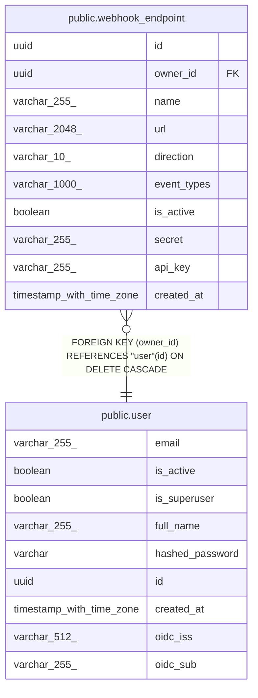

# public.webhook_endpoint

## Description

Inbound or outbound webhook configuration.

## Columns

| Name | Type | Default | Nullable | Children | Parents | Comment |
| ---- | ---- | ------- | -------- | -------- | ------- | ------- |
| id | uuid |  | false |  |  | Primary key. |
| owner_id | uuid |  | false |  | [public.user](public.user.md) | Owner user; cascades on delete. |
| name | varchar(255) |  | false |  |  | Human-readable endpoint name. |
| url | varchar(2048) |  | true |  |  | Target URL for outbound webhooks; null for inbound. |
| direction | varchar(10) |  | false |  |  | "inbound" or "outbound". |
| event_types | varchar(1000) |  | true |  |  | Comma-separated event types (e.g. contact.created,interaction.logged). |
| is_active | boolean |  | false |  |  | Enable or disable without deleting. |
| secret | varchar(255) |  | true |  |  | HMAC secret for verifying inbound payloads. |
| api_key | varchar(255) |  | false |  |  | Key required to authenticate inbound webhook requests. |
| created_at | timestamp with time zone |  | false |  |  | When the endpoint was created (UTC). |

## Constraints

| Name | Type | Definition |
| ---- | ---- | ---------- |
| webhook_endpoint_api_key_not_null | n | NOT NULL api_key |
| webhook_endpoint_created_at_not_null | n | NOT NULL created_at |
| webhook_endpoint_direction_not_null | n | NOT NULL direction |
| webhook_endpoint_id_not_null | n | NOT NULL id |
| webhook_endpoint_is_active_not_null | n | NOT NULL is_active |
| webhook_endpoint_name_not_null | n | NOT NULL name |
| webhook_endpoint_owner_id_not_null | n | NOT NULL owner_id |
| webhook_endpoint_owner_id_fkey | FOREIGN KEY | FOREIGN KEY (owner_id) REFERENCES "user"(id) ON DELETE CASCADE |
| webhook_endpoint_pkey | PRIMARY KEY | PRIMARY KEY (id) |

## Indexes

| Name | Definition |
| ---- | ---------- |
| webhook_endpoint_pkey | CREATE UNIQUE INDEX webhook_endpoint_pkey ON public.webhook_endpoint USING btree (id) |
| ix_webhook_endpoint_owner_id | CREATE INDEX ix_webhook_endpoint_owner_id ON public.webhook_endpoint USING btree (owner_id) |
| ix_webhook_endpoint_direction | CREATE INDEX ix_webhook_endpoint_direction ON public.webhook_endpoint USING btree (direction) |

## Relations

---

> Generated by [tbls](https://github.com/k1LoW/tbls)
